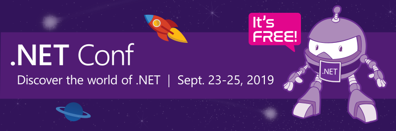

# .NET Conf 2019 "Event-in-a-Box"

## September 23 - 25, 2019 [www.dotnetconf.net](https://www.dotnetconf.net)
.NET Conf is a free, 3 day virtual developer event co-organized by the .NET community and Microsoft. This year, .NET Core 3.0 launches at .NET Conf! This repo contains creative and technical content for running a .NET Conf 2019 local event or watch party in your community as well as information on how to syndicate the broadcast on your own sites. 

If you are intested in running a local event or watch party between Sept 23 and Oct 31, please make sure you let us know by filling out this survey: [www.surveymonkey.com/r/dotnetconf2019](https://www.surveymonkey.com/r/dotnetconf2019). We will advertize your event on [www.dotnetconf.net/local-events](https://www.dotnetconf.net/local-events).

# Event Guidelines
You are free to organize a watch party to view the online broadcast live and/or organize a presentation, workshop, or hack-a-thon anytime until Oct 31. The technical content needs to be .NET related and preferably on the latest releases. Topics can include but aren't limited to: .NET Core, ASP.NET Core, Xamarin, Unity, UWP, Visual Studio family, C#/F#/Visual Basic, .NET cloud development with Azure, Machine Learning & AI with .NET, .NET open source projects.  

# Technical Content
Session decks can be found in the `Technical` folder. All sessions are also on-demand after the show on the [Visual Studio YouTube channel](https://www.youtube.com/playlist?list=PLReL099Y5nRd04p81Q7p5TtyjCrj9tz1t). Also check out more .NET presentations and workshops here: [https://github.com/dotnet-presentations/home](https://github.com/dotnet-presentations/home)

# Creative & Social Copy 
The `Creative` folder contains creative banners and images you can use to advertise .NET Conf and your local events. There are a variety of sizes to choose from. You may use any of these banners to advertize the main event itself, or your local events in your community. You may add your local meetup name, location and dates to these images. You may not change the .NET Conf branding. Please contact [dotnetconf@dotnetfoundation.org](mailto:dotnetconf@dotnetfoundation.org) if you have any questions.  

Please help us promote .NET Conf on social media! On Twitter, use the hashtag [#dotnetconf](https://twitter.com/search?q=%23dotnetconf). Here's some examples of posts you can create to help us. 

## Facebook

Save the date for .NET Conf 2019 - a free, community event for .NET developers around the world with livestreamed tech talks, online discussion, and local in-person events. .NET Core 3.0 launches at .NET Conf! 

Get the latest on .NET Core and ASP.NET Core, C#, F#, Azure, Visual Studio, Xamarin, and much more. 

Make sure to RSVP for session announcements, event locations, and prize opportunities!

*Share Facebook Event: [https://www.facebook.com/events/892668944404403/](https://www.facebook.com/events/892668944404403/)*

## Twitter

.NET Core 3.0 launches at #dotNETConf 2019! 3 days of free #dotnet #developer content streaming live around the globe. Save the date! https://aka.ms/dotnetconf_savedate

***

Save the date for #dotNETConf, a free, online conference for everyone in the .NET community from beginners to seasoned engineers. https://aka.ms/dotnetconf_savedate

***

New to #dotNETConf? Check out the videos from last year and save September 23-25 for this year's event.  https://aka.ms/dotnetconf_savedate

***

# Syndication

.NET Conf 2019 will broadcast the first two days of the conference from Microsoft studios. You can syndicate the broadcast on your own developer-focused sites. Take a look at the [syndication instructions](Syndication/Syndication.pdf) and contact [dotnetconf@dotnetfoundation.org](mailto:dotnetconf@dotnetfoundation.org) and let us know you want to be involved!

