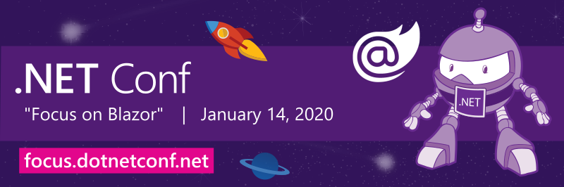

# ".NET Conf: Focus on Blazor" is a wrap!

## Thank you!

A huge THANK YOU to all who tuned in live, asked questions, and participated in our twitter feed. We had awesome sessions from various experts that that dove deep into building web apps with Blazor. 

*.NET Conf: Focus on Blazor* is a free, one-day livestream event that featured speakers from the community and .NET teams that are working on building web apps with C# and Blazor. You don't need to use JavaScript anymore with Blazor technology! Blazor lets you build interactive web UIs using C# instead of JavaScript.

Just getting started? Head to [www.blazor.net](https://blazor.net).

## Recordings
Watch all the sessions on demand on [.NET YouTube Channel](https://www.youtube.com/playlist?list=PLdo4fOcmZ0oWlP1Qpzg7Dwzxr298ewdUQ) or [Channel9](https://channel9.msdn.com/Events/dotnetConf/Focus-on-Blazor).

## Technical
Session decks and demos that were shown can be found in the `Technical` folder. 

Also see the [Blazor Workshop](https://github.com/dotnet-presentations/blazor-workshop) to learn how to build a complete Blazor app end-to-end.  

## Stay in touch
[Subscribe to notifications](http://eepurl.com/gvEhgX) to keep up with .NET Conf news and join the conversation [#dotNETConf](https://twitter.com/search?q=%23dotnetconf).
