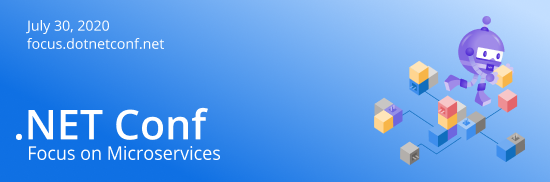

# ".NET Conf: Focus on Microservices" Code & Slides!

## Here You Go!

This part of the repo contains the links to the videos, slides and any code samples we got from our speakers. We will add more content as it comes in from the presenters. We hope you enjoy them and happy coding!

### Welcome to .NET Conf: Focus on Microservices
[Scott Hunter](https://twitter.com/coolcsh), [David Fowler](https://twitter.com/davidfowl)  

Scott and David from the .NET team kick off the day with .NET Core features, roadmap and lots of demos of building microservices with .NET.

- [Slides](dotNETMicroservices_Welcome.pptx)   
- [Video](https://youtu.be/ZEvoxXnsbbU)
- [Demo](https://github.com/dotnet-presentations/dotNETConf/tree/master/2020/FocusOnMicroservices/keynote)

### Why You Should Care About Microservices 
[Brendan Burns](https://twitter.com/brendandburns)  

Hear from the co-founder of Kubernetes about why microservices are important and why you should care about them.

- [Slides](WhyMicroservices.pptx)
- [Video](https://youtu.be/7hY6fggwHqU)

### Stay Sharp 
[Kelsey Hightower](https://twitter.com/kelseyhightower)  

Kelsey shows us how developers in other ecosystems do microservices development and gives valuable advice and lessons learned building systems at scale.  

- [Video](https://youtu.be/x_IGNq4snx8)

### A Journey into .NET Microservices with Steeltoe 
[David Dieruf](https://twitter.com/DierufDavid)

The Steeltoe project aims to help you get the most out of the cloud, with very little code. By taking advantage of .NET Core’s dependency injection and middleware pipeline, it gives developers instant best practices. Steeltoe also helps legacy .NET Framework apps become instantly modern and make best friends with containers.

- [Slides](David-Dieruf-Microservices-And-Steeltoe.pdf)
- [Video](https://youtu.be/3meYereHHtM)
- [Demo](https://github.com/ddieruf/Steeltoe-Basic-API) 

### Orleans at Microsoft
[Reuben Bond](https://twitter.com/reubenbond)  

See how Orleans, an open source, cross-platform, distributed application framework, is used to build hyper-scale, highly-available systems at Microsoft.

- [Video](https://youtu.be/KhgYlvGLv9c)

### Adding a Little DAPR to Your .NET Microservices 
[Cecil Philip](https://twitter.com/cecilphillip)  

DAPR makes building distributed applications much easier by providing a collection of language agnostic building blocks that can be used in any cloud or on-prem environment. In this session, we’ll dive into DAPR, discuss the various build blocks it supports, and see some demos of how you can make use of it in your .NET applications.

- [Slides](AddingDAPR-DotNETConf.pptx)
- [Video](https://youtu.be/g-gOlkD9lKs)

### Developing and Deploying Microservices with 'Tye' 
[Glenn Condron](https://twitter.com/condrong), [Justin Kotalik](https://twitter.com/JustinKotalik)  

Learn about new tooling the .NET team is working on to help you build microservices faster.

- [Slides](TyeNetConfPresentation.pptx)
- [Video](https://youtu.be/MMIUpYOQq5Y)

### Beyond REST and RPC: Asynchronous Eventing and Messaging Patterns
[Clemens Vasters](https://twitter.com/clemensv/)  

In this session you will learn about when and why to use asynchronous communication with and between services, what kind of eventing/messaging infrastructure you can use in the cloud and on the edge, and how to make it all work together.

- [Slides](Beyond-REST-and-RPC-Asynchronous-Eventing-and-Messaging-Patterns.pptx)
- [Video](https://youtu.be/6zs-PhgfLU4)

### The Intersection of Microservices, Domain-Driven Design and Entity Framework Core 
[Julie Lerman](https://twitter.com/julielerman)  

Domain-Driven Design (DDD) provides much of the strategic design guidance that we can use to determine the boundaries around and interactions between Microservices in our solutions. DDD also follows up with tactical design patterns for your business logic. In this session we’ll take a look at some of these patterns and how EF Core naturally, or with some additional configuration, persists the data that your microservices depend on.

- [Slides](lerman_ef_ddd_microservices.pdf)
- [Video](https://youtu.be/DG8Qe7TJiIE)
- [Demo](https://github.com/julielerman/dotnetconfms2020)

### Build High-performance Microservices with gRPC and .NET 
[James Newton-King](https://twitter.com/JamesNK)  

gRPC is a high-performance RPC framework designed for microservices. In this talk you will learn how to use gRPC in .NET and see how gRPC is ideal for fast communication between microservices.

- [Video](https://youtu.be/HVq4TstHCEs)

### DevOps, Waffles, and Superheroes - Oh My!
[Jessica Deen](https://twitter.com/jldeen)  

Microservices can be hard; understanding container best practices can be hard as those practices are still being discovered. This session helps you minimize the learning curve with container orchestration, specifically Kubernetes, by bringing DevOps best practices into the mix.

- [Video](https://youtu.be/5BkKjTxIokU)

### API Communication in Microservices with Azure API Management and Azure Functions
[LaBrina Loving](https://twitter.com/chixcancode)

Managing how clients communicate to your microservices can become quite a challenge as your application grows in size and complexity.  Implementing an API Gateway to provide a single point of entry to microservices can address some of those concerns.  In this talk, I will show how to use API Management and Azure Functions to manage external API communication in microservices-based architectures.

- [Video](https://youtu.be/YLMsAMvY4KA)

### Evolving .NET Framework Monoliths with .NET 5 and Kubernetes
[Elton Stoneman](https://twitter.com/EltonStoneman)  

You want to migrate your .NET monolith to microservices so you can run it in Kubernetes? That could be a year-long project, and you really don't need to do it. This session gives you a pragmatic approach to evolving your monolith, breaking features out into new microservices to get all the benefits of Kubernetes without a full rewrite. We'll start by running a legacy app in Windows containers and end with a distributed app running across Linux and Windows containers in the same Kubernetes cluster.

- [Video](https://youtu.be/Wbjh4T-cdv8)
- [Slides](evolving-monoliths-dotnet5-kubernetes.pptx)
- [Demo](https://github.com/sixeyed/presentations/tree/master/dotnetconf/2020/microservices)

### Migrating .NET Framework Web Apps to Azure
[Carey Payette](https://twitter.com/careypayette)  

You don't have to have a micorservice-based architecture to take advantage of the cloud. In this session, Carey shows you how to take a monolith WebForms application and make it cloud ready with minimal work.

- [Slides](migratingdotnettothecloud.pdf)
- [Video](https://youtu.be/UT_Fd-Pkiuw)
- [yaml file used in her demo](proddeploy.yml)

### Building & Debugging Microservices faster using Kubernetes and Visual Studio
[Shayne Boyer](https://twitter.com/spboyer)

See how you can take advantage of Visual Studio tools to build, debug and deploy microservices to Kubernetes faster.

- [Slides](DevelopDebugMicroservices.pptx)
- [Video](https://youtu.be/98nIvg7ne7Q)

### Post-Conference Workshop
[Rob Vettor](https://twitter.com/robvettor), [Monu Bambroo](https://twitter.com/BambrooMonu) 

6+ hour workshop going deep into how to build .NET microservice-based applications on Azure. 

- For slides see the `\Workshop` folder
- [Video 1](https://www.youtube.com/watch?v=jMDufMYAsmw&list=PLdo4fOcmZ0oUc2ShrReCS7KoBbPEONE0p&index=17&t=0s)
- [Video 2](https://www.youtube.com/watch?v=u7MM21aIsqk&list=PLdo4fOcmZ0oUc2ShrReCS7KoBbPEONE0p&index=18&t=0s)
- [Video 3](https://www.youtube.com/watch?v=iL3Kxd4Auys&list=PLdo4fOcmZ0oUc2ShrReCS7KoBbPEONE0p&index=19&t=0s)
- [Video 4](https://www.youtube.com/watch?v=3G7NB4waGbk&list=PLdo4fOcmZ0oUc2ShrReCS7KoBbPEONE0p&index=20&t=0s)
- [Video 5](https://www.youtube.com/watch?v=qwEfynnevEU&list=PLdo4fOcmZ0oUc2ShrReCS7KoBbPEONE0p&index=21&t=0s)
- [Video 6](https://www.youtube.com/watch?v=7kVmb747vfM&list=PLdo4fOcmZ0oUc2ShrReCS7KoBbPEONE0p&index=22&t=0s)
