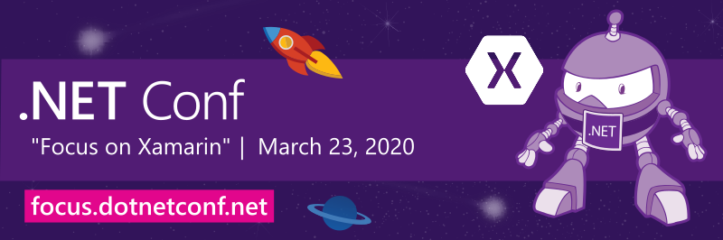

# ".NET Conf: Focus on Xamarin" is a wrap!

## Thank you!

A huge **THANK YOU** to all who tuned in live, asked questions, and participated in our twitter feed. We had awesome sessions from various experts that showed us the power of Xamarin and .NET! 

*.NET Conf: Focus on Xamarin* is a free, one-day livestream event that features speakers from the community and .NET product teams that are working on building native mobile apps with Xamarin technology! Xamarin lets you build native mobile apps for Android and iOS with C# instead of Java and Swift.

Just getting started? Head to [www.xamarin.com](https://www.xamarin.com).

## Recordings
Watch all the sessions on demand on [.NET YouTube Channel](https://www.youtube.com/playlist?list=PLdo4fOcmZ0oW4W_qQr_dlnKtAfTB0Ezl9) or [Channel9](https://channel9.msdn.com/Events/dotnetConf/Focus-on-Xamarin).

## Technical
Session decks and demos that were shown can be found in the [Technical](Technical) folder. 

## Stay in touch
[Subscribe to notifications](http://eepurl.com/gvEhgX) to keep up with .NET Conf news and join the conversation [#dotNETConf](https://twitter.com/search?q=%23dotnetconf).
