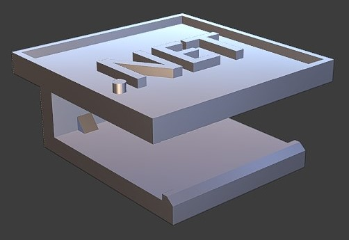
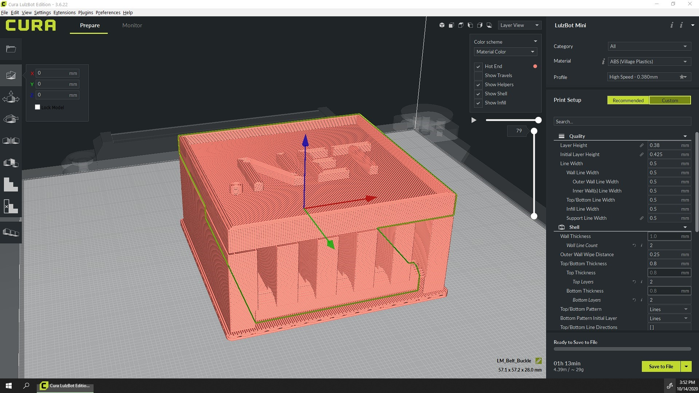

## .NET Belt 3D Printing Guide

The .NET belt is meant to used as a belt cover going over the belt buckle.

### File type:
    .STL
    GCODE (set to below dimensions)

### Recommendations:
    Materials
        HIPS, ABS, PLA
   
    Orientation
        .NET Logo facing up
    
    Size
        57.15mm x 57.15mm x 28mm
        Scaling the model may bring varied results and loss of detail. For best results make sure your model is set to the
        recommended size above.
    
    Settings
        Raft build plate with an extra margin of 1mm
        Supports enabled
        Infill 20% or higher
        Layer Height 0.25mm

### Images:

