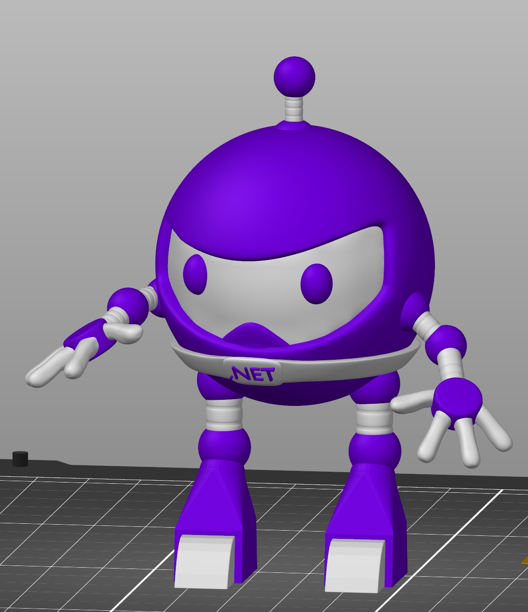
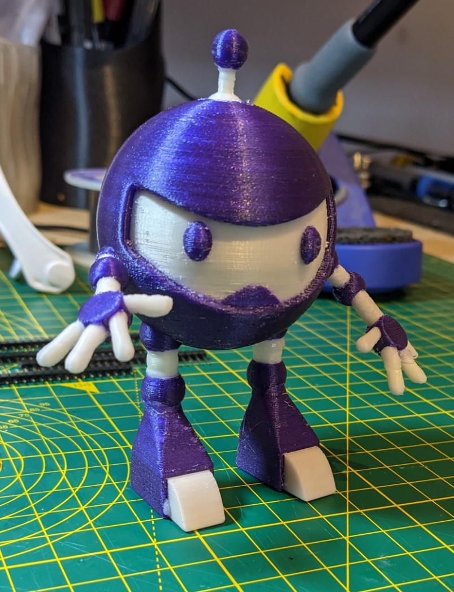

# 3D-DotNetBot

3D Printable DotNet bot.

This repo contains the 3D STL files that can be used to 3D print a nice little DotNet Bot, here is one printed earlier.

## Printer.

I would recommend that you use a Multi Material Unit so that you can print in many colours, I use a Prusa I3 Mk3S fitted with the MMU2 unit which you can buy from [Here](https://shop.prusa3d.com/en/3d-printers/180-original-prusa-i3-mk3s-kit.html).

## Settings.

However if you already own a 3D printer and want to print and have the kids paint it to give it colour then the settings I suggest are:

    Material -          PLA
    Layer Height -      0.2mm (Or half your Nozzle Diameter)
    Support -           Yes required but Build Bed Only will work
    Raft -              Not required.
    Infill -            Around 20% should work

## Model

The model is 100mm tall but if you want larger or smaller you can scale in your slicer program, beware that making it much smaller means that the detail will drop and things like the Belt will not show in the final print.

## Recognition

This model was designed by Clifford Agius and Modelled in Blender by Macauley Agius as a fun project and we hope you enjoy printing lots of them.