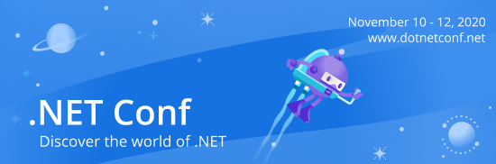

# .NET Conf 2020 Code & Slides!

This part of the repo contains the links to the videos, slides and any code samples we got from our speakers. We will add more content as it comes in from the presenters. We hope you enjoy them and happy coding!

Watch the sessions on demand on the [.NET YouTube Channel](https://www.youtube.com/playlist?list=PLdo4fOcmZ0oVWop1HEOml2OdqbDs6IlcI) and [Channel 9](https://channel9.msdn.com/Events/dotnetConf/2020/).

## Day 1
### Keynote - Welcome to .NET 5
[Scott Hunter](https://twitter.com/coolcsh)

Scott Hunter, Director of Program Management for .NET, will kick off the day with loads of new demos and some very special guests.

- [Slides](dotNETConf2020-keynote.pptx)
- [Video](https://www.youtube.com/watch?v=o-esVzL3YLI&list=PLdo4fOcmZ0oVWop1HEOml2OdqbDs6IlcI&index=3)

### .NET Foundation "State of the Foundation"
[Claire Novotny](https://twitter.com/clairernovotny) | [Layla Porter](https://twitter.com/laylacodesit)

Take a look at what the .NET Foundation has been up to and how to get involved.

- [Slides](dotnetconf2020_FoundationUpdate.pptx)
- [Video](https://www.youtube.com/watch?v=ppIBnjAdgik&list=PLdo4fOcmZ0oVWop1HEOml2OdqbDs6IlcI&index=4)

### What’s New in C#?
[Mads Torgersen](https://twitter.com/MadsTorgersen) | [Dustin Campbell](https://twitter.com/dcampbell)

Dustin and Mads take you on a tour of the new features in C# 9.0: Top-level programs remove clutter. Init-only properties and records improve support for immutable and value-based programming. New patterns take pattern matching to the next level. Can Dustin type as fast as Mads can speak, and vice versa? Only one way to find out!

- Slides
- [Video](https://www.youtube.com/watch?v=x3kWzPKoRXc&list=PLdo4fOcmZ0oVWop1HEOml2OdqbDs6IlcI&index=5)

### A talk for trailblazers: Blazor in .NET 5
[Steve Sanderson](https://twitter.com/stevensanderson) | [Safia Abdalla](https://twitter.com/captainsafia)

Wondering what’s in store for Blazor in .NET 5? Wonder no more! This talk features the latest and greatest features to arrive in Blazor as part of .NET 5. From improved APIs for working with the browser to CSS isolation to a variety of performance improvements, you’ll leave this presentation with rundown of everything you’ll be able to do in the latest version of Blazor.

- [Slides](Abdalla_Sanderson_blazor-in-net5.pptx)
- [Video](https://www.youtube.com/watch?v=Nag6u5TxjIA&list=PLdo4fOcmZ0oVWop1HEOml2OdqbDs6IlcI&index=6)

### Porting Projects to .NET 5
[Immo Landwerth](https://twitter.com/terrajobst) | [Phillip Carter](https://twitter.com/_cartermp)

Want to move to .NET 5? In this session you'll see how to approach porting projects from .NET Framework, .NET Core, and .NET Standard to .NET 5 and the tools you can use to get there.

- [Slides](dotnetconf2020_immol_phcart_porting.pptx)
- [Video](https://www.youtube.com/watch?v=bvmd2F11jpA&list=PLdo4fOcmZ0oVWop1HEOml2OdqbDs6IlcI&index=7)

### Entity Framework Core 5.0: The Next Generation for Data Access
[Jeremy Likness](https://twitter.com/jeremylikness) | [Shay Rojansky](https://twitter.com/shayrojansky)

Use C#, .NET classes, and LINQ to interact with databases like Sqlite, Azure SQL Server and even Azure Cosmos DB from .NET 5 apps with Entity Framework Core. See the latest features in action like many-to-many, table-per-type and new diagnostics features.

- [Slides](Likness_dotnetconf-efcore5-next-gen.pptx)
- [Video](https://www.youtube.com/watch?v=BIImyq8qaD4&list=PLdo4fOcmZ0oVWop1HEOml2OdqbDs6IlcI&index=8)

### Modern Web Development with Blazor & .NET 5
[Dan Roth](https://twitter.com/danroth27) | Javier Calvarro Nelson

Blazor isn’t just for new apps! Blazor in .NET 5 is integrated seamlessly with ASP.NET Core to enable modern full stack web development with .NET. In this session we’ll show you how you can use Blazor and ASP.NET Core together to add rich client-side interactivity to both new and existing apps. You’ll learn how to use Blazor components from your existing MVC views and Razor Pages, handle server-side prerendering, setup authentication & authorization, improve load time performance, and then deploy your app into production.

- [Slides](Roth_modern-web-dev-with-blazor-and-dotnet5.pptx)
- [Video](https://www.youtube.com/watch?v=CEjqhTGrqDY&list=PLdo4fOcmZ0oVWop1HEOml2OdqbDs6IlcI&index=9)

### Xamarin.Forms 5: Beautiful and Fast Apps with Less Code
[Maddy Leger](https://twitter.com/maddyleger1) | [David Ortinau](https://twitter.com/davidortinau)

Xamarin.Forms 5 is jam-packed with new features to make it easier than ever to develop fast, beautiful, cross-platform apps. Come see what new features are in Xamarin.Forms 5, and learn more about how our Xamarin Community Toolkit is getting more features than ever into your hands!

- Slides
- [Video](https://www.youtube.com/watch?v=M7UVz82dE90&list=PLdo4fOcmZ0oVWop1HEOml2OdqbDs6IlcI&index=10)

### Developing and Deploying Microservices with 'Tye'
[David Fowler](https://twitter.com/davidfowl) | [Glenn Condron](https://twitter.com/condrong)

Learn about new tooling the .NET team is working on to help you build, debug and deploy microservices faster.

- [Slides](Condron_dotentConf2020_Tye.pptx)
- [Video](https://www.youtube.com/watch?v=_s8UdhGOGmY&list=PLdo4fOcmZ0oVWop1HEOml2OdqbDs6IlcI&index=11)

### Get to know the .NET 5.0 SDK
[Kathleen Dollard](https://twitter.com/KathleenDollard) | [Rainer Sigwald](https://twitter.com/tashkant)

.NET 5 is the next version of .NET Core. The .NET SDK incudes the language compilers for C#, Visual Basic and F#. It also includes NuGet to manage packages, MSBuild to build and publish projects, and miscellaneous things like the templating engine. The .NET CLI and the community .NET tools enhance your command line experience and integrate with Visual Studio. Get a big picture of the .NET SDK and see what's new in 5.0.

- Slides
- [Video](https://www.youtube.com/watch?v=WmOCtlvNaTQ&list=PLdo4fOcmZ0oVWop1HEOml2OdqbDs6IlcI&index=12)

### Introducing F# 5
[Phillip Carter](https://twitter.com/_cartermp)

For the past five years, we've been working to make F# as good as it can on .NET Core. With the release of .NET 5, we're also introducing F# 5 - the culmination of this work. F# 5 makes interactive programming a joy, and introduces the building blocks for the next era of F#. Come see how!

- Slides
- [Video](https://www.youtube.com/watch?v=MPlVE8WdD-0&list=PLdo4fOcmZ0oVWop1HEOml2OdqbDs6IlcI&index=13)

### .NET 5 Runtime Deep Dive with Rich Lander and the Architects
[Rich Lander](https://twitter.com/runfaster2000) | [Stephen Toub](https://twitter.com/stephentoub) | [Jan Kotas](https://twitter.com/jankotas7)

Go deep into some of the .NET 5 runtime features like performance improvements, how single-file applications work, ARM64 support, and more.

- Slides
- [Video](https://www.youtube.com/watch?v=qJXJnop1bZ0&list=PLdo4fOcmZ0oVWop1HEOml2OdqbDs6IlcI&index=14)

### ML.NET in the Real World
[Bri Achtman](https://twitter.com/briacht) | [Kundan Karma](https://twitter.com/kundankarma) | [Brett Parker](https://twitter.com/_Brett_Parker) | [Chris Felstead](https://twitter.com/TechLeadKit)

Hear from real life .NET developers about the problems they decided to solve with Machine Learning and why they chose ML.NET to add ML to their apps.

- [Slides](Achtman_dotnetconf2020-mlnet-in-real-world.pptx)
- [Video](https://www.youtube.com/watch?v=3MlR7cf8A6k&list=PLdo4fOcmZ0oVWop1HEOml2OdqbDs6IlcI&index=15)

### What's new for desktop developers building WPF, UWP & WinForms
[Dmitry Lyalin](https://twitter.com/lyalindotcom)

In this session we'll be taking you on a tour of what's new for desktop developers building applications using WPF, UWP and Windows Forms. We'll cover improvements in tooling such as what's new in XAML data binding diagnostic, XAML designer and Hot Reload. We'll also dive into WinForms topics such as designer and new features, explore .NET 5 support for ClickOnce and more!

- [Slides](Lyalin_dotnetconf2020-desktop-dmitry.pptx)
- [Video](https://www.youtube.com/watch?v=NDYcq1yKhiA&list=PLdo4fOcmZ0oVWop1HEOml2OdqbDs6IlcI&index=16)

### High-performance Services with gRPC: What's new in .NET 5
[James Newton-King](https://twitter.com/jamesnk)

gRPC is a high-performance RPC framework used by developers around the world to build fast apps. In this talk you will learn about what's new in gRPC for .NET 5, like performance improvements, gRPC-Web, Blazor WebAssembly support, Hosting on Http.sys and IIS, and OpenTelemetry.

- [Slides](Newton-King_gRPC-dofnetconf-2020.pptx)
- [Video](https://www.youtube.com/watch?v=EJ8M2Em5Zzc&list=PLdo4fOcmZ0oVWop1HEOml2OdqbDs6IlcI&index=17)

### Developer Fun with Scott Hanselman
[Scott Hanselman](https://twitter.com/shanselman)

Wind down a little from the day's sessions and learn some fun new things.

- [Video](https://www.youtube.com/watch?v=28D_roo3cUw&list=PLdo4fOcmZ0oVWop1HEOml2OdqbDs6IlcI&index=18)

## Day 2
### GitHub + Visual Studio ❤ .NET
[Vix Rian](https://twitter.com/vixgrows) | [Andy Sterland](https://twitter.com/andysterland)

GitHub and Visual Studio technologies have evolved and provide unique productivity enhancements to all .NET developers. Join this demo-filled session to see how it benefits you.

- [Slides](Rian_dotnetconf2020_GitHub_Codespaces.pptx)
- [Video](https://www.youtube.com/watch?v=YqeIuTYdX4c&list=PLdo4fOcmZ0oVWop1HEOml2OdqbDs6IlcI&index=19)

### Effectively Diagnose and Debug .NET Apps in Visual Studio
[Mark Downie](https://twitter.com/poppastring)

Debug .NET Core running on Linux, master async debugging, and squeeze the last bit of performance out of your apps with the new features in Visual Studio.

- [Slides](Downie_dotnetConf_Effectively_diagnose_and_debug_.NET_in_Visual_Studio.pptx)
- [Video](https://www.youtube.com/watch?v=cOYFDD3tU38&list=PLdo4fOcmZ0oVWop1HEOml2OdqbDs6IlcI&index=20)

### What’s New in Visual Studio 2019 and beyond
[Caty Caldwell](https://twitter.com/catycaldwell)

Learn what’s new in latest Visual Studio 2019 as well as features the team is currently working on - including some that we’ve never shown to the public before.

- Slides
- [Video](https://www.youtube.com/watch?v=E17rD75Kn9Q&list=PLdo4fOcmZ0oVWop1HEOml2OdqbDs6IlcI&index=21)

### Improve Your Productivity with Roslyn Analyzers
[Mika Dumont](https://twitter.com/mika_dumont) | [Kendra Havens](https://twitter.com/gotheap)

Learn about Roslyn Analyzers and how it can supercharge your developer productivity. This session includes tips on how to leverage smart code focused tools, such as code fixes and refactorings and an introduction to write your own customized code fix and refactoring using Roslyn's open source API.

- [Slides](Dumont_Havens_dotnetconf2020_Improve_Your_Productivity_with_Roslyn_Analyzers.pptx)
- [Video](https://www.youtube.com/watch?v=Ma1FBFcLqMs&list=PLdo4fOcmZ0oVWop1HEOml2OdqbDs6IlcI&index=22)

### HTTP API Development with .NET, Azure, and OpenAPI: Paper Cuts Begone!
[Brady Gaster](https://twitter.com/bradygaster)

If you build HTTP APIs in .NET you probably have ceremonies you iterate through because the construction and testing of HTTP APIs hasn't *ever* been easy. Teams all over Microsoft have been working together to make the API development a joyful experience, as you'll see in this end-to-end tour.

- [Slides](gaster-http-apis.pptx)
- [Video](https://www.youtube.com/watch?v=G7Le65Ln_Qk&list=PLdo4fOcmZ0oVWop1HEOml2OdqbDs6IlcI&index=23)

### Accelerate .NET to Azure with GitHub Actions
[Isaac Levin](https://twitter.com/isaacrlevin)

GitHub Actions makes it easy to automate all your software workflows, now with world-class CI/CD. Easily deploy your .NET Core application to Azure with just one tool, GitHub.

- [Slides](Levin_Accelerate_.NET_to_Azure_with_GitHub_Actions.pptx)
- [Video](https://www.youtube.com/watch?v=3SP8SgcEFyw&list=PLdo4fOcmZ0oVWop1HEOml2OdqbDs6IlcI&index=24)

### Real-time 3D Games with .NET and Unity
[John Miller](https://twitter.com/jmillerdev) | [Abdullah Hamed](https://twitter.com/indiesaudi)

Are you curious how to take your .NET skills to 25+ platforms like VR, AR, Xbox, and Switch to make amazing games and apps? Join this session to learn more about the Unity real-time 3D development platform and how your .NET skills can give you a head start towards that next big idea.

- [Slides](Miller_Hamed_dotnetconf-2020-UnityTools.pptx)
- [Video](https://www.youtube.com/watch?v=1RDFU4ZJAD4&list=PLdo4fOcmZ0oVWop1HEOml2OdqbDs6IlcI&index=25)

### Introducing the New and Improved Azure SDK for .NET
[Jeffrey Richter](https://twitter.com/jeffrichter)

Come learn about the new Azure SDK for .NET and the improvements to performance, authentication and configuration that we have been working on in the last couple of years.

- [Slides](Richter_The_New_Improved_Azure_SDK_for_.NET.pptx)
- [Video](https://www.youtube.com/watch?v=v36NXLU3TLY&list=PLdo4fOcmZ0oVWop1HEOml2OdqbDs6IlcI&index=26)

### The Missing Piece - Diving into the World of Big Data with .NET for Apache Spark
[Rahul Potharaju](https://twitter.com/rahulpotharaju) | [Jeremy Likness](https://twitter.com/jeremylikness)

Data is growing at an unprecedented amount with both human generated and machine generated data. Come, learn about the open-source, .NET for Apache Spark project, the same technology that teams such as Office, Dynamics and Azure use widely to process 100s of Terabytes of data inside Microsoft.

- Slides
- [Video](https://www.youtube.com/watch?v=wRN6ExbW7kA&list=PLdo4fOcmZ0oVWop1HEOml2OdqbDs6IlcI&index=27)

### Collecting ASP.NET Core Performance Traces in a Kubernetes Cluster
[Mike Rousos](https://twitter.com/mjrousos)

Do you need to gather data on CPU usage, memory usage, or other potential performance issues for a containerized ASP.NET Core app? This talk will cover what you need to know to collect performance traces from ASP.NET Core apps running in a Kubernetes cluster.

- [Slides](Rousos_dotnetconf-aks-diagnostics.pptx)
- [Video](https://www.youtube.com/watch?v=NxU6kphrCAg&list=PLdo4fOcmZ0oVWop1HEOml2OdqbDs6IlcI&index=28)

### Secretless Development from Local to Cloud with the New Azure SDKs, Project Tye, and Kubernetes
[Jon Gallant](https://twitter.com/jongallant)

Are you tired of managing secrets for local and cloud development? With the new Azure SDKs you can rid your applications of secrets with the new Azure Identity library. Come see how we implemented a secretless solution from local development with Project Tye to Azure Kubernetes Service.

- Slides
- [Video](https://www.youtube.com/watch?v=IgYXJ4ZHuas&list=PLdo4fOcmZ0oVWop1HEOml2OdqbDs6IlcI&index=29)

### Bringing .NET Interactive to Azure Data Studio Notebooks
[Alan Yu](https://twitter.com/alanyusql) | [Jon Sequeira](https://twitter.com/jonsequitur)

Azure SQL customers love Jupyter notebooks, especially having dedicated SQL, PowerShell, and C# kernels. This was a perfect opportunity to partner with the .NET interactive team to provide a consistent notebook experience. Come listen to our open source collaboration journey to make this possible.

- Slides
- [Video](https://www.youtube.com/watch?v=938jBJ-tK3c&list=PLdo4fOcmZ0oVWop1HEOml2OdqbDs6IlcI&index=30)

### Secure DevOps with the Microsoft Identity Platform
[Christos Matskas](https://twitter.com/ChristosMatskas) | [John Dandison](https://twitter.com/AzureAndChill)

Supercharge your devops skills and learn how to deploy and run your solutions securely in Azure using the Microsoft Identity Platform, ARM, service principals and Managed Identities. In this demo-rich session, you'll find out how to leverage the right tools and elevate DevOps to the next level!

- [Slides](Matskas_Dandison_dotnetconf2020-Secure_Dev_Ops.pptx)
- [Video](https://www.youtube.com/watch?v=Spprpp1o5nM&list=PLdo4fOcmZ0oVWop1HEOml2OdqbDs6IlcI&index=31)

### Get Your JAM On
[Aaron Powell](https://twitter.com/slace)

You are embarking on a new project and have decided to go full Serverless and try out that JAMStack. After all, our application is a Blazor WASM app and some APIs, so Serverless is the perfect fit. But how do we design this solution, tackle local development and most importantly deploy to the cloud? In this session, you'll see how.

- [Slides](Powell_2020-get-your-jam-on-dotnetconf.pptx)
- [Video](https://www.youtube.com/watch?v=9cwOsW5KBm0&list=PLdo4fOcmZ0oVWop1HEOml2OdqbDs6IlcI&index=32)

### Migrate & Modernize ASP.NET Applications with Azure App Service and .NET 5
[Gaurav Seth](https://twitter.com/segaurav) | [Byron Tardif](https://twitter.com/bktv99)

Learn how to modernize .NET Framework Apps, by migrating to App Service and 5 ways to get started with .NET 5 on App Service.

- Slides
- [Video](https://www.youtube.com/watch?v=hel9PC0G0KA&list=PLdo4fOcmZ0oVWop1HEOml2OdqbDs6IlcI&index=33)

### Blazor: Client Side vs. Server Side: Hands on Development and Deployment
[Dr. Otto Dobretsberger](https://twitter.com/OttoD)

We will look at the main differences between Client Side Blazor, and Server Side Blazor. We will discuss situations and scenarios in which one should be favored over the other. We will develop a small app & deploy it twice on Azure: As a Client Side Blazor App, and as a Server Side Blazor App.

- [Slides](dotnetconf2020-deck-Dobretsberger.pptx)
- [Video](https://www.youtube.com/watch?v=-FDQX1jmj64&list=PLdo4fOcmZ0oVWop1HEOml2OdqbDs6IlcI&index=34)

### Setting Up Feature Flags with .NET
[Talia Nassi](https://twitter.com/talia_nassi)

Let's set up feature flags with .NET! We will walk through how to create a feature flag in the UI, install dependencies, and implement your feature flag in your .NET app.

- [Slides](Nassi_.NET_Conf.pdf)
- [Video](https://www.youtube.com/watch?v=IJ1BRSLZDgg&list=PLdo4fOcmZ0oVWop1HEOml2OdqbDs6IlcI&index=35)

### Level-up Your DevOps with GitHub Actions and Kubernetes
[Rob Richardson](https://twitter.com/rob_rich)

Are you looking to rapidly deploy your content? Are Docker containers in your future? Come for this demo-only presentation where we start from scratch, build up a DevOps pipeline with GitHub Actions, and deploy to Kubernetes. Once setup, commit, and watch the magic flow into place.

- Slides
- [Video](https://www.youtube.com/watch?v=TMbXwNtuAJo&list=PLdo4fOcmZ0oVWop1HEOml2OdqbDs6IlcI&index=36)

### Migrating a Windows Forms App to Blazor: The Amazing and True Story of GIFBot
[Georgia Nelson](https://twitter.com/fiercekittenz)

In this talk, I will discuss the migration steps undertaken to go from a complex Desktop application to a robust ASP.NET-backed website with a Blazor front-end. The talk will highlight the ease at which I was able to translate functionality as a developer with very outdated web development skills.

- Slides
- [Video](https://www.youtube.com/watch?v=NRDdu67VJH0&list=PLdo4fOcmZ0oVWop1HEOml2OdqbDs6IlcI&index=37)

### Create a Text Parser in C# with ANTLR
[Robin Reynolds-Haertle](https://twitter.com/geysergazer)

Caught with an unusual data format and want to convert it to something more friendly? Instead of writing buckets of string manipulation code, use ANTLR and C# to parse and make sense of that data. This talk will cover interesting uses of ANTLR and demonstrate parsing a unique data format.

- Slides
- [Video](https://www.youtube.com/watch?v=lc9JlXyBG4E&list=PLdo4fOcmZ0oVWop1HEOml2OdqbDs6IlcI&index=38)

### Asynchronous Coroutines with C#
[Andrew Nosenko](https://twitter.com/noseratio)

Coroutines are state-machine-style functions that can be suspended, resumed and executed cooperatively by yielding. In C# they are traditionally implemented as IEnumerable. With C# 8+, it's possible to combine "await" and "yield" within the same method, so we can have asynchrony inside coroutines. Come see how.

- [Slides](Nosenko_Asynchronous_Coroutines_with_C#.pptx)
- [Video](https://www.youtube.com/watch?v=pE6b2Bs3U9Q&list=PLdo4fOcmZ0oVWop1HEOml2OdqbDs6IlcI&index=39)

### Bring Intelligence to the Edge with Custom Vision
[Stefano Tempesta](https://twitter.com/stefanotempesta)

Get familiar with with Custom Vision, its API and ML algorithms for image classification, and explore an app for image capturing that uses a trained model with Custom Vision based on a custom image dataset.

- Slides
- [Video](https://www.youtube.com/watch?v=Y1MYveP-smk&list=PLdo4fOcmZ0oVWop1HEOml2OdqbDs6IlcI&index=40)

### C# Source Generators - Write Code that Writes Code
[David Wengier](https://twitter.com/davidwengier)

With C# 9 there is finally an officially supported mechanism for generating source code into your .NET projects as part of the compiler pipeline. Lets run through how they work, some of the pros and cons, and play around with ideas to get your mind racing with the possibilities.

- [Slides](Wengier_Source_generators.pptx)
- [Video](https://www.youtube.com/watch?v=3YwwdoRg2F4&list=PLdo4fOcmZ0oVWop1HEOml2OdqbDs6IlcI&index=41)

### Setting up Health Checks for an ASP.NET Core application and its Dependencies
[Clyde D'Souza](https://twitter.com/clydedz)

Site availability is crucial for the reputation and revenue of a business. In this session, we're going to look at setting up health checks for our ASP.NET Core application, its dependencies, and what your end-to-end transparent site uptime monitoring and reporting system might look like.

- [Slides](D'Souza_healthcheck-clydedsouza-dotnetconf2020.pptx)
- [Video](https://www.youtube.com/watch?v=cFslS0b_2dg&list=PLdo4fOcmZ0oVWop1HEOml2OdqbDs6IlcI&index=42)

### Maximising Algorithm Performance in .NET: Levenshtein Distance
[James Turner](https://twitter.com/MrTurnerj)

With performance tricks you may not know on an algorithm you may never have heard of before, be prepared to learn about my journey from different array structures to pointers, SIMD to threading, as we take the journey to maximum performance together.

- [Slides](Turner_dotnetconf2020-levenshtein-distance.pptx)
- [Video](https://www.youtube.com/watch?v=JiOYajl2Mds&list=PLdo4fOcmZ0oVWop1HEOml2OdqbDs6IlcI&index=43&t=10s)

### Enterprise Search Engine with Azure Cognitive Search and Unsupervised Machine Learning
[Priyanka Shah](https://twitter.com/fuzzymind1)

Is your search engine missing word semantics? What if I want my search for "electric cars" to give me results for "green energy", or a search for "lithium" give results about "dry cells". Experience the power of cognitive search, topic modelling, neural word embedding with unsupervised ML to achieve this.

- Slides
- [Video](https://www.youtube.com/watch?v=76jqiQTDxpw&list=PLdo4fOcmZ0oVWop1HEOml2OdqbDs6IlcI&index=44)

### Building Reusable Rich UI controls using PowerApps Component Framework (PCF)
[Dharanidharan Balasubramaniam](https://twitter.com/dharani1743) | [Jeevarajan Kumar](https://twitter.com/crmindian)

The Power Apps component framework empowers professional developers and app makers to create code components for model-driven and canvas apps and provides enhanced user experiences for users working with data on forms, views, and dashboards. In this session, I am going to explain how we can build reusable rich UI controls using the PowerApps Component Framework (PCF).

- Slides
- [Video](https://www.youtube.com/watch?v=B09iomS9vug&list=PLdo4fOcmZ0oVWop1HEOml2OdqbDs6IlcI&index=45)

### Architecting Cloud Native Application in Azure using .NET Core
[Menaka Baskar](https://twitter.com/MenakaBasker)

In this session we will discuss about why .NET is a perfect blend to deliver Cloud Native applications.

- Slides
- [Video](https://www.youtube.com/watch?v=espeHztMDS8&list=PLdo4fOcmZ0oVWop1HEOml2OdqbDs6IlcI&index=46)

### Controlling My Home Sauna Using .NET 5
[Johnny Hooyberghs](https://twitter.com/djohnnieke)

Today, .NET can really run everywhere. Come see how I was able to completely modernize my sauna controller by using .NET on a Raspberry Pi with Gpio support, .NET on Xamarin Forms, and .NET in a Docker container on a Linux host.

- [Slides](Hooyberghs_controlling-my-home-sauna-using-dotnet5.pdf)
- [Video](https://www.youtube.com/watch?v=kkRqnYbVYuY&list=PLdo4fOcmZ0oVWop1HEOml2OdqbDs6IlcI&index=47)
