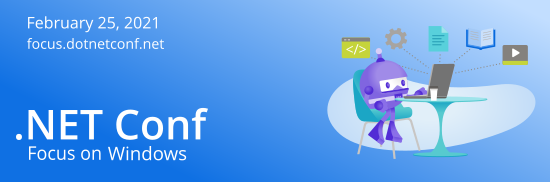

# ".NET Conf: Focus on Windows" is a wrap!

## Thank you!

A huge THANK YOU to all who tuned in live, asked questions, and participated in our twitter feed. We had awesome sessions from various experts that that dove deep into building Windows desktop apps. 

*.NET Conf: Focus on Windows* is a free, one-day livestream event that featured speakers from the community and .NET teams. See how you can move your Windows apps forward to take advantage of modern platforms, components, and tools no matter what .NET app model you're using. Learn why and how to upgrade WPF and Windows Forms apps to .NET 5, see Visual Studio tooling improvements, learn how to leverage cloud services from your client apps, and a whole lot more. You'll also see what the future of native device development with .NET will look like in .NET 6.

## Recordings 
Watch all the sessions on demand on [.NET YouTube Channel](https://www.youtube.com/playlist?list=PLdo4fOcmZ0oUQ42lnr4bDYfStYe_5rKS0) or [Channel9](https://channel9.msdn.com/Events/dotnetConf/Focus-on-Windows).

## Technical
Session decks and demos that were shown can be found in the [`Technical`](Technical) folder. 

## Stay in touch
[Subscribe to notifications](http://eepurl.com/gvEhgX) to keep up with .NET Conf news and join the conversation [#dotNETConf](https://twitter.com/search?q=%23dotnetconf).
