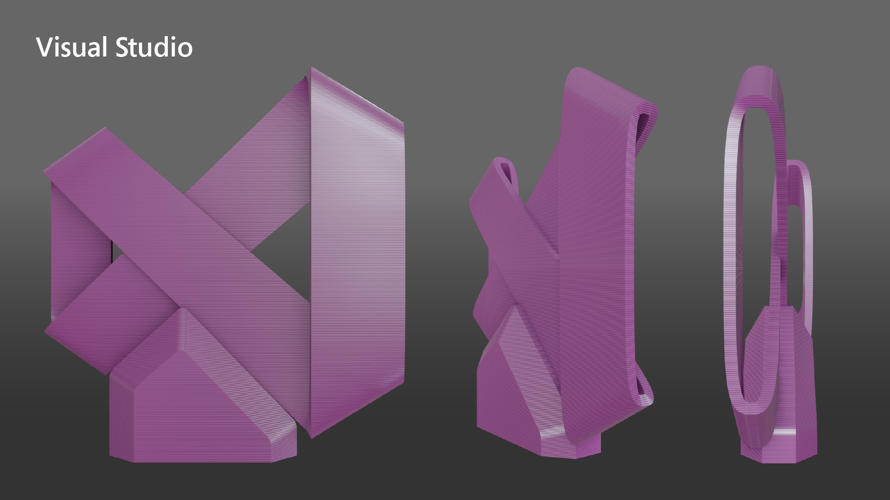

## Visual-Studio-logo-3D
The Visual-Studio-logo-3D.STL file is a 3D printable sculpture of the Visual Studio logo.
Test prints were created on a stock LulzBot Mini with the following settings:

#### File type:
    .STL

#### Recommendations:
    Overall model size 
        98.7 mm x 21.9 mm x 106.1 mm
    
    Settings 
        Rafts: No 
        Supports: Yes 
        Resolution: Standard 
        Infill: 20% 
        Recommended color: Purple, Black, White 
        
    Clean up 
        Use clippers on supports and frayed filament 
    
#### Render image:

