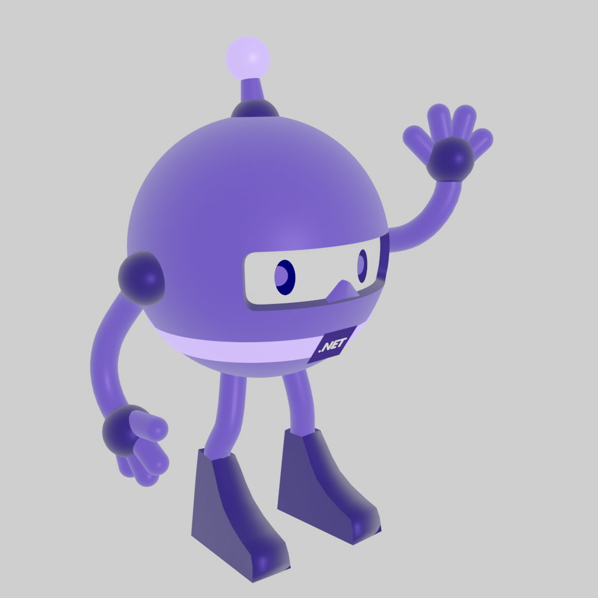

# dotnet-bot-3D
This folder contains .NET bot 3D files and instructions for: Animation & 3D printing.

## dotnet-bot Animation
#### File types
    Blend

    FBX 

    Tpose FBX

#### Moving the Rig: Pose mode
In Blender, Right click the Rig and go from “object mode” into “Pose mode”.

    Bones:

        Root: Move, rotate
        Every bone in the rig will move with this bone. 
        Body, Foot, and IK Knees are parented to this bone.

    Body: Move, rotate

        This bone is parented to the Root bone and has a 
        constant offset with the root bone. 
        Hands, Shoulders, Eyes, Legs, and Antenna are all parented to this bone.

    Antenna: Rotate

        This bone only rotates

    Foot: Move, Rotates

        Control the Foot Bone-in tandem with IK Knee

    Knee: Move

        The knee will always track  the position of this bone

    Hand: Move, rotate

        Control the Hand Bone-in tandem with the IK Elbow.

    Elbow: Move

        The Elbow will always track the position.

    Eyes: Rotate

        This bone has a constraint on it that limit its rotation to 
        around the Z-axis -10 to +10 degrees.

    Iris Flipper: Move

        Move the bone 1M to the left-hand side of the character to flip the eyes. 
        This bone is a driver and controls a blend shape that acts as a switch.

    Fingers: Rotate

        All fingers have two-point to be used for rotation. 
        Center of hand and knuckle.

Important Blender Hotkeys

    ESC: To cancel most actions in the 3D viewport
    G: Move // R: Rotate // S: Scale
    X: X Axis // Y: Y Axis // Z: Z Axis

View controls (Number pad)

    1: Front
    3: Side
    7: Top
    5: Perspective
    Z: Render modes

### Visual animation here

***

# dotnet-bot 3D printing

The .NET Bot is a 3D printable statue

### File type
    .STL
    GCODE (set to size dimensions below)
    Blend

### Recommendations

Materials
    
    ABS, PLA

Orientation
    
    dotnet-bot should be printed on its feet or back

Size

    4 inches vertical

    Scaling the model may bring varied results and loss of detail. 
    
    For best results make sure your model is set to the recommended size above. 

Settings 

    Raft build plate with an extra margin of 1mm

    Supports enabled

    Infill 20% or higher

    Layer Height 0.25mm

### Reference

