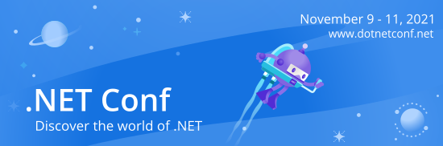

# .NET Conf 2021 Code & Slides!

### Keynote
[Scott  Hunter](https://twitter.com/coolcsh) [Daniel Roth](https://twitter.com/danroth27) [Maria Naggaga](https://twitter.com/LadyNaggaga) [Mads Torgersen](https://twitter.com/MadsTorgersen) [Maddy Leger Montaquila](http://twitter.com/maddymontaquila) 

Join Scott Hunter and team as they show you all the amazing things you can do with .NET 6.

- [Slides](dotnetconf2021-Keynote.pptx)
- [Video](https://channel9.msdn.com/Events/dotnetConf/2021/Keynote)
- [Demos - .NET Podcasts](https://github.com/microsoft/dotnet-podcasts)

### Post-keynote wrap up
[Scott  Hunter](https://twitter.com/coolcsh) 

- [Video](https://channel9.msdn.com/Events/dotnetConf/2021/Post-keynote-Wrap-Up)

### What's new in C# 10
[Mads Torgersen](https://twitter.com/MadsTorgersen) [Dustin Campbell](https://twitter.com/dcampbell) 

C# 10 brings many improvements focused around enabling cleaner and simpler code in many scenarios.

- [Video](https://channel9.msdn.com/Events/dotnetConf/2021/Whats-new-in-C-10)

### Enterprise-grade Blazor apps with .NET 6
[Daniel Roth](https://twitter.com/danroth27) 

Blazor in .NET 6 gives you the functionality you need to build real world apps of any size and complexity. In this session we'll look at the new Blazor features in .NET 6 for practical web app development. We'll look at the new support for Hot Reload,  error boundaries, state preservation during prerendering, faster file uploads, query string handling, adding page metadata, and integrating Blazor components into existing JavaScript based apps.

- [Slides](Roth_Enterprise-grade_Blazor_apps_with_.NET6.pptx)
- [Video](https://channel9.msdn.com/Events/dotnetConf/2021/Enterprise-grade-Blazor-apps-with-NET-6)

### Introduction to .NET MAUI
[Maddy Leger Montaquila](http://twitter.com/maddymontaquila) 

.NET MAUI is the best way to build cross platform mobile and desktop apps with .NET and C#. Join Maddy Leger, .NET MAUI Program Manager, to get a first look of .NET MAUI in .NET 6 and learn how you can start using it today. 

- [Video](https://channel9.msdn.com/Events/dotnetConf/2021/Introduction-to-NET-MAUI)

### What's New in F# 6
[Kathleen Dollard](https://twitter.com/KathleenDollard) [Don Syme](https://twitter.com/dsymetweets) 

F# 6 is all about modernizing and simplifying the experience of learning and using F#.  This applies to the language design, library, performance and tooling. The most significant technical feature in F# 6 is a new mechanism for authoring async tasks that is easier and faster. List and arrays also got faster – in some cases 4 times faster! Language simplification includes more consistent rules for indentation, more implicit conversions, and letting you skip that period between an identifier and the square bracket of an index. You’ll find five new operations on collections and be able to access Keys and Values of a Map. Tooling is also improved  with better performance, pipeline debugging, and better access to C# projects in your solution. Come hear more about F# 6!

- [Slides](Dollard-Syme_Whats_new_in_FSharp_6.pptx)
- [Video](https://channel9.msdn.com/Events/dotnetConf/2021/Whats-New-in-F-6)

### Speed up your .NET development with Hot Reload
[Dmitry Lyalin](https://www.twitter.com/lyalindotcom) 

With .NET Hot Reload our goal is to save you as many app restarts between edits as possible, making you more productive by reducing the time you spend building/restarting as you continue to build your app. In this session we will look at how this technology works in Visual Studio 2022 with demos across .NET MAUI, Blazor, ASP.NET Core and desktop apps. We'll also cover why .NET 6 is the best version to get the most of out this technology, what are its limitations and what we hope to do in the future.

- [Video](https://channel9.msdn.com/Events/dotnetConf/2021/Speed-up-your-NET-development-with-Hot-Reload)

### Testing tools for .NET and cross-platform apps
[Kendra Havens](https://twitter.com/gotheap) 

Get the most out of testing with .NET test tools. We'll cover the latest performance improvements and completely new capabilities such as remote testing with containers, wsl, and even over SSH! Join this session to get tips on new features that speed up your inner development flow and learn about the latest in cross-platform, asynchronous web UI testing: Playwright.

- [Video](https://channel9.msdn.com/Events/dotnetConf/2021/Testing-tools-for-NET-and-cross-platform-apps)

### Supercharge your Productivity with Roslyn and AI
[Mika Dumont](https://twitter.com/mika_dumont) 

Roslyn brings smart code analysis to your fingertips along with IntelliCode's AI powered tools to help supercharge your developer productivity. This demo-heavy session includes new tips to help you understand code at a glance and the tooling improvements around Razor, code style, diagnostics, and much more!

- [Video](https://channel9.msdn.com/Events/dotnetConf/2021/Supercharge-your-Productivity-with-Roslyn-and-AI)

### Minimal APIs in .NET 6
[Stephen Halter](https://twitter.com/halter73) [Safia Abdalla](https://twitter.com/captainsafia) 

In this talk, Safia and Stephen, developers from the ASP.NET team, will introduce you to minimal APIs, a new, low-ceremony way to build small HTTP APIs using ASP.NET Core

- [Video](https://channel9.msdn.com/Events/dotnetConf/2021/Minimal-APIs-in-NET-6)

### ASP.NET Core MVC & Razor Pages in .NET 6
[Daniel Roth](https://twitter.com/danroth27) 

ASP.NET Core & Razor Pages are the foundations for many modern web apps. Check out what's new for ASP.NET Core MVC & Razor Pages in .NET 6 including Hot Reload, nullability checking, CSS isolation, Bootstrap 5, async streaming, IAsyncDisposable support, and faster build times.

- [Slides](Roth_ASP.NET_Core_MVC_Razor_Pages_in_.NET6.pptx)
- [Video](https://channel9.msdn.com/Events/dotnetConf/2021/ASPNET-Core-MVC--Razor-Pages-in-NET-6)

### Next-generation Blazor components with .NET 6
[Daniel Roth](https://twitter.com/danroth27) Javier Calvarro Nelson 

Blazor in .NET 6 enables building even more powerful and flexible web UI components. In this session we'll look at the new improvements to the Blazor component model, including required component parameters, generic type inference from ancestor components, JavaScript initializers, and handling of static web assets.

- [Slides](Roth_Next-generation_Blazor_components_with_.NET6.pptx)
- [Video](https://channel9.msdn.com/Events/dotnetConf/2021/Next-generation-Blazor-components-with-NET-6)

### What's New in EF Core 6
[Jeremy Likness](https://twitter.com/JeremyLikness) [Arthur Vickers](https://twitter.com/ajcvickers) 

EF Core 6 is a cross-platform object-mapper that enables C# developers to use domain classes and strongly typed LINQ queries to interface with a backend database. EF Core 6 is the latest version that features performance improvements, support for temporal tables, cloud-native-friendly migration bundles, improved handling of complex queries and substantial improvements to the Azure Cosmos DB provider. See these new features in action and learn when to use them and why they are helpful in this demo-packed session.

- [Slides](Likness-Vickers_What’s_New_in_EF_Core_6​.pptx)
- [Video](https://channel9.msdn.com/Events/dotnetConf/2021/Whats-New-in-EF-Core-6)

### Upgrading from .NET Framework to .NET 6
[Cathy Sullivan](https://twitter.com/cathysull) Sunanda Balasubramanian 

Learn how to bring your .NET Framework apps forward to .NET 6 to take advantage of the latest performance improvements, deployment flexibility and new language innovations.

- [Video](https://channel9.msdn.com/Events/dotnetConf/2021/Upgrading-from-NET-Framework-to-NET-6)

### Build cross-platform native apps with .NET MAUI and Blazor
[Eilon Lipton](https://twitter.com/original_ejl) 

The power of Blazor is coming to native apps on desktop and mobile devices! Use existing Blazor web components and get the power of native apps, or supercharge your existing native apps with the power and reach of Blazor with the new BlazorWebView control for .NET MAUI, WPF, and WinForms.

- [Video](https://channel9.msdn.com/Events/dotnetConf/2021/Build-cross-platform-native-apps-with-NET-MAUI-and-Blazor)

### Secure minimal APIs with .NET 6 and Microsoft Identity
[Christos Matskas](https://twitter.com/christosmatskas) 

Join Christos and JP to learn how to build secure minimal APIs with .NET 6 and Microsoft Identity! Demos, demos and more demos to show you how to Implement strong authorization with only a few lines of code - this is the session for YOU

- [Video](https://channel9.msdn.com/Events/dotnetConf/2021/Secure-minimal-APIs-with-NET-6-and-Microsoft-Identity)

### .NET Everywhere - Windows, Linux, and Beyond
[Scott Hanselman](https://twitter.com/shanselman) 

How many places can .NET run? Let's find out. How many places can I develop with .NET? Let's find out! Demos demos demos in this technical session

- [Video](https://channel9.msdn.com/Events/dotnetConf/2021/NET-Everywhere-Windows-Linux-and-Beyond)

### Warp-speed WebAssembly with Blazor in .NET 6
[Steve Sanderson](https://twitter.com/stevensanderson/) 

With .NET 6, the underlying .NET WebAssembly runtime supports entirely new kinds of functionality, and can be faster and more productive than ever before.

“Native dependencies” enables embedding libraries from other tech stacks (e.g., a C/C++ database engine, or a Rust media processor). AOT compilation brings truly near-native performance to your .NET code in the browser, and the new build toolchain can now strip out unused native code to ship significantly smaller bundles.

This talk explores how you can build new kinds of web apps, while having a more enjoyable and productive experience via instant hot reload and a better Razor editor.

- [Slides](Sanderson_New_Blazor_WebAssembly_capabilities_in_.NET_6​.pptx)
- [Video](https://channel9.msdn.com/Events/dotnetConf/2021/New-Blazor-WebAssembly-capabilities-in-NET-6)

### 6 ways to get started with .NET 6 and App Service
[Byron Tardif](http://twitter.com/bktv99) 

App Service is the fasted way to start your cloud journey. Learn 6 different ways to get started with .NET 6 and App Service.

- [Slides](Tardif_6_ways_to_get_started_with_.NET_6_and_App_Service.pptx)
- [Video](https://channel9.msdn.com/Events/dotnetConf/2021/6-ways-to-get-started-with-NET-6-and-App-Service)

### ML.NET: Machine learning from data to production in less than 30 minutes
[Bri Achtman](https://twitter.com/briacht) [Luis Quintanilla](https://twitter.com/ljquintanilla) 

Getting machine learning models from experimentation to production is an industry-wide challenge. ML.NET is a free, cross-platform, and open-source machine learning framework built for .NET developers that simplifies the model training and deployment process by keeping everything in the same ecosystem. In this session, we'll use ML.NET tooling in Visual Studio to quickly train a machine learning model, and then we will deploy the model to a .NET MAUI application.

- [Slides](Achtman-Quintanilla_ML.NET_Machine_learning.pptx)
- [Video](https://channel9.msdn.com/Events/dotnetConf/2021/MLNET-Machine-learning-from-data-to-production-in-less-than-30-minutes)

### Full-stack .NET with Blazor WebAssembly and Azure Static Web Apps
[Anthony Chu](https://twitter.com/nthonyChu) [Simona Cotin](https://twitter.com/simona_cotin) 

With automatic global distribution, custom domains, and free SSL certificates, Azure Static Web Apps has everything you need to deploy modern web applications with serverless APIs. Join us to learn all about how to deploy Blazor WebAssembly apps with .NET Azure Functions to Azure Static Web Apps.

- [Slides](Chu-Cotin_Full-stack_.NET​_with_Blazor_WebAssembly_​and_Azure_Static_Web_Apps.pptx)
- [Video](https://channel9.msdn.com/Events/dotnetConf/2021/Full-stack-NET-with-Blazor-WebAssembly-and-Azure-Static-Web-Apps)

### Enhance your .NET apps with Azure Communication Services
Chris  Palmer [Mary Anne Noskowski](https://twitter.com/tiedyemare) 

Building rich communication experiences—enabled by voice, video, chat, email, or SMS— has become an integral part in how businesses are connecting with their customers across devices and platforms. Future proofing your business to address the challenges that change customer, developer, and business needs is more critical than ever.

In this session, we’ll run through a blueprint on how you can use .NET to build client and service communication applications. Delivering a video call on Windows? Building a Bot or service that sends SMS or makes phone calls? We'll cover it all and more.

- [Slides](Palmer-Noskowski​_Enhance_your_.NET_apps_with_Azure_Communication_Services.pptx)
- [Video](https://channel9.msdn.com/Events/dotnetConf/2021/Enhance-your-NET-apps-with-Azure-Communication-Services)

### Bring More Power to your Web API's with the Power Platform
[April Dunnam](https://twitter.com/aprildunnam) 

Is your API getting as much use as it could?  Low code technology is emerging as a primary way to develop applications.  In this session, we'll explore how you can unlock opportunity and bring more power to your Web API's by integrating them with the Power Platform.  

- [Slides](Dunnam_Bring_More_Power_to_your_Web_API’s_with_the_Power_Platform_.pdf)
- [Video](https://channel9.msdn.com/Events/dotnetConf/2021/Bring-More-Power-to-your-Web-APIs-with-the-Power-Platform)

### Microsoft Teams app development with Visual Studio and .NET
[John Miller](https://twitter.com/jmillerdev) [Pierce Boggan](https://twitter.com/pierceboggan) 

An introduction to creating apps for Microsoft Teams using Visual Studio and Teams Toolkit. 

Follow along to see how using Teams Toolkit, a new extension for Visual Studio, helps streamline development for Microsoft Teams. 

We'll explore the Blazor Server template, single-sign-on, Fluent UI Blazor components, and more about the future of Teams Toolkit.

- [Slides](JMiller-Boggan_Microsoft_Teams_App_Development_with_Visual_Studio_and_.NET.pdf)
- [Video](https://channel9.msdn.com/Events/dotnetConf/2021/Microsoft-Teams-app-development-with-Visual-Studio-and-NET)

### Serverless .NET 6 with Azure Functions
[Anthony Chu](https://twitter.com/nthonyChu) [Fabio Cavalcante](https://twitter.com/codesapien)

Azure Functions lets you write serverless functions in .NET Framework, .NET Core, and now .NET 6. Join us to learn all about the latest version of Azure Functions with support for .NET 6.

- [Slides](Chu-Cavalcante_Serverless_.NET_6​_with_Azure_Functions.pptx)
- [Video](https://channel9.msdn.com/Events/dotnetConf/2021/Serverless-NET-6-with-Azure-Functions)

### Develop amazing WIndows apps using the Windows App SDK
[Andrew Clinick](https://twitter.com/andrewclinick) Andrew Whitechapel Dian Hartono [Eve Mwangi](https://twitter.com/eve_mevey) 

Tap into the full power of a Windows PC with your desktop applications! See how we're unifying the developer platform through the Windows App SDK, enabling you to build amazing Windows apps for Windows 10 and 11. You'll also learn about our work on WinUI (the native UI stack in Windows), .NET and  Win32.

If you are targeting Windows, this is the tech you need to know.

- [Slides](Hartono_WindowsAppSDKSessionOutro.pptx)
- [Video](https://channel9.msdn.com/Events/dotnetConf/2021/Develop-amazing-WIndows-apps-using-the-Windows-App-SDK)

### Build .NET Applications with Visual Studio Code
[Luis Quintanilla](https://twitter.com/ljquintanilla) 

VS Code, along with its extensions for .NET development, provides you with a lightweight environment for writing code in C# and F# on macOS and Linux, in addition to Windows. Join us to see how you can use VS Code for developing for any platform with .NET and its various application models, whether it's for web development or machine learning.

- [Video](https://channel9.msdn.com/Events/dotnetConf/2021/Build-NET-Applications-with-Visual-Studio-Code)

### Modern data APIs with EF Core and GraphQL
[Jeremy Likness](https://twitter.com/JeremyLikness) 

What if you could simplify service discovery by consolidating your APIs to a single endpoint, give your front end applications full control over the shape of data they receive (without implementing multiple REST APIs or overloading endpoints with parameters), and provide advanced filtering and sorting over your data using only a few lines of code? See yourself how powerful GraphQL is, especially when combined with EF Core, to provide modern data APIs that can be reused across the enterprise.

- [Slides](Likness_Modern_Data_APIs_with_EF_Core_and_GraphQL​.pptx)
- [Video](https://channel9.msdn.com/Events/dotnetConf/2021/Modern-data-APIs-with-EF-Core-and-GraphQL)

### Diagnostics and Observability of .NET Applications
[Sourabh Shirhatti](https://twitter.com/sshirhatti) 

Come learn about the latest improvements in .NET Diagnostics. We'll cover how the latest improvements in logging, metrics, and distributed tracing can help you better monitor and observe the health of your application.

- [Video](https://channel9.msdn.com/Events/dotnetConf/2021/Diagnostics-and-Observability-of-NET-Applications)

### High-performance services with gRPC: What's new in .NET 6
[James Newton-King](https://twitter.com/JamesNK) 

gRPC is a high-performance RPC framework used by developers around the world to build fast apps.

In this talk you will learn about what’s new in gRPC for .NET 6, including:

* Performance improvements
* Transient fault handling with retries
* Client-side load balancing
* gRPC with HTTP/3

- [Slides](Newton-King_High-performance_services_with_gRPC​_What’s_new_in_.NET_6.pptx)
- [Video](https://channel9.msdn.com/Events/dotnetConf/2021/High-performance-services-with-gRPC-Whats-new-in-NET-6)

### Microservices Made Easy!
[Jessica Deen](http://twitter.com/jldeen) 

Have you made the jump to microservices only to discover the development experience is less than ideal? We get it, microservices can be HARD, but they don’t have to be. In this session we will help you simplify your developer interloop and boost your productivity, by bringing DevOps Best Practices into the mix. We will focus on open-source tooling, coupled with GitHub Actions to demonstrate how easy it write, test, and debug your microservice code, while confidently delivering it to your end users. While there is an assumption you are familiar with microservices and Kubernetes, you will enhance your skillset by learning about specific tools that can provide better orchestration for cloud services, abstraction, and encapsulation for your microservices deployments.

- [Slides](Deen_Microservices_Made_Easy!.pdf)
- [Video](https://channel9.msdn.com/Events/dotnetConf/2021/Microservices-Made-Easy)

### What's new in .NET Interactive notebooks
[Alan Yu](https://twitter.com/alanyusql) [Julie Koesmarno](http://twitter.com/mssqlgirl) 

Multi-language experiences in Jupyter Notebooks continues to be one of the most asked for features in the community. With the addition of T-SQL support in .NET Interactive, this opens the door for more language support and language interaction in a single notebook experience. You won't want to miss this session where you will learn about the latest improvements in .NET Interactive including several exciting announcements.

- [Video](https://channel9.msdn.com/Events/dotnetConf/2021/Whats-new-in-NET-Interactive-notebooks)

### Building reliable and portable microservices with Dapr and .NET
[Paul Yuknewicz](https://twitter.com/paulyuki99) 

We build microservices to achieve high degrees of horizontal scale and reliability in our distributed apps.  Dapr is an API for building reliable and portable microservices.  You will learn in this session how to use Dapr in microservice communication and pub sub, and how best practices for security and portability are already built in.  We'll also show you tips and tricks to get more gains out of the APIs in your existing code. 

- [Slides](Yuknewicz.dapr.pptx)
- [Video](https://channel9.msdn.com/Events/dotnetConf/2021/Building-reliable-and-portable-microservices-with-Dapr-and-NET)

### Not Thinking Small - My Journey to Learning .NET
[Elahn Harris](https://twitter.com/CodeThLightning) 

What would you do if you knew you could not fail? What excites you? What makes you happy to be alive? For me, one of the things that make me happy to be alive is learning how to code, and starting my coding journey with C#, Blazor, and .Net. 

In the process of learning how to code, I've learned how to hack my own mind. I've learned and unlearned. The biggest lesson that I've learned is that freedom and innovation is born when you decide to stop playing small.

- [Slides](Harris_Not_Thinking_Small_-_My_Journey_to_Learning_.NET​.pptx)
- [Video](https://channel9.msdn.com/Events/dotnetConf/2021/Not-Thinking-Small-My-Journey-to-Learning-NET)

### Stories from interning on the .NET team
[Cathy Sullivan](https://twitter.com/cathysull) [Jessica Houghton](https://twitter.com/jessh164) Sophia Carpenter 

Every summer, hundreds of college students join the Developer Division at Microsoft for their internships and many of them get to work on really cool .NET projects!

Come hear a few of them share their stories about what it's like to intern on the .NET team and how .NET customers like you helped shaped their projects and make them come to life!

- [Slides](Carpenter-Houghton-Sullivan_Stories_from_interning_on_the_.NET_team.pptx)
- [Video](https://channel9.msdn.com/Events/dotnetConf/2021/Stories-from-interning-on-the-NET-team)

### Benchmarking ASP.NET Applications with .NET Crank
[Sebastien Ros](https://twitter.com/sebastienros) 

Use the same open source tools as the ASP.NET team to benchmark web applications, detect regressions, gather performance traces.

- [Slides](Ros_Benchmarking_ASP.NET_Applications_with_​_.NET_Crank​.pptx)
- [Video](https://channel9.msdn.com/Events/dotnetConf/2021/Benchmarking-ASPNET-Applications-with-NET-Crank)

### Power Up Your Development with Power Automate and Power Apps
[Matt Soucoup](https://twitter.com/codemillmatt) 

.NET developers do not need to know about low-code dev with Power Apps and Power Automate, it's just for business professionals, right? Low-code offers something for everybody, from automating everyday tasks to making high-code APIs available in Power Apps. In this session you'll find out how you can supercharge everyday tasks with Power Automate - like send a message to Teams whenever a task gets opened in Azure DevOps. You'll learn how you can make your web APIs and Azure Functions available to Power Apps developers through custom connectors. And you'll learn about Fusion Development teams - a concept that lets you build better apps faster by letting you concentrate on where you'll make the most impact.

- [Slides](Soucoup_Power_Up_You_Development_with_Power_Apps_and​_Power_Automate.pptx)
- [Video](https://channel9.msdn.com/Events/dotnetConf/2021/Power-Up-Your-Development-with-Power-Automate-and-Power-Apps)

### Updates on Migrating to Azure App Service
[Gaurav Seth](https://twitter.com/segaurav) Kristina  Halfdane 

During this Azure App Service session, we will provide a demo of the new Azure Migrate Hub discovery and assessment feature as well as the Powershell migration experience. Using these new and current Azure migration tools you can migrate .NET sites for a single server or entire datacenter.

- [Slides](Seth-Halfdane_Azure_Migrate_Migrating_Web_Apps_to_Azure_App_Services.pptx)
- [Video](https://channel9.msdn.com/Events/dotnetConf/2021/Migrating-Web-Apps-to-Azure-App-Services)

### Blazor Azure B2C Authentication and Authorization
[Michael Washington](https://twitter.com/ADefWebserver) 

In this session we will cover how you can use Azure B2C authentication and authorization within your Blazor application to manage your users, and to allow your users to log in using their preferred social and enterprise logins.

- [Slides](Washington_Blazor_Azure_B2C_Authentication_and_Authorization.pptx)
- [Video](https://channel9.msdn.com/Events/dotnetConf/2021/Blazor-Azure-B2C-Authentication-and-Authorization)
- Demo

### Accelerate .NET to Azure with GitHub Actions... Again?
[Isaac Levin](http://www.twitter.com/isaacrlevin) 

Last year, we went through how .NET developers can leverage GitHub Actions to make their journey to Azure a great one. During that session, we only scratched the surface of the capabilities of GitHub Actions. In this session, we continue our conversation past introduction and see just how far we can take GitHub Actions to better the developer experience.

- [Slides](Levin_Accelerate_.NET_to_Azure_with_GitHub_Actions_-_Again.pptx)
- [Video](https://channel9.msdn.com/Events/dotnetConf/2021/Accelerate-NET-to-Azure-with-GitHub-Actions-Again)

### Enterprise IoT with full .NET using Meadow on Embedded Hardware
[Adrian Stevens](https://twitter.com/adrian_stevens) [bryan costanich](https://twitter.com/bryancostanich) 

In just a few years there will be 10x as many non-mobile connected devices as human beings. Powering these devices are microcontrollers; the new frontier in computing that enables compute power in nearly everything everywhere for just a few dollars. In this session, learn how to use full .NET on these devices with Meadow; an enterprise-grade, secure IoT platform that lets you use your existing C#/F#/VB.NET skills to create interactive, embeddable hardware. Read from sensors, persist data in a local database, upload to the cloud, and more.

- [Slides](Constanich-Stevens_Enterprise_IoT_for_Every_Developer_with_Meadow​.pdf)
- [Video](https://channel9.msdn.com/Events/dotnetConf/2021/Enterprise-IoT-with-full-NET-using-Meadow-on-Embedded-Hardware)

### .NET Internet of Things
[Melissa Houghton](https://twitter.com/meliss_houghton) 

.NET is your platform for building anything, including the Internet of Things. The powerful cross-platform, open-source framework has libraries to support hundreds of IoT devices, allows you to build applications quickly, integrate easily with Azure IoT Services, and apply machine learning models to your data.

You can use .NET to power your IoT solutions, from device integration and data processing to digital twins and end-user applications. In this session, we will tour .NET in the world of IoT and how you can use it today to build robust .NET Internet of Things solutions.

- [Slides](Houghton_.NET_Internet_of_Things.pptx)
- [Video](https://channel9.msdn.com/Events/dotnetConf/2021/NET-Internet-of-Things)

### Brand New! Azure Functions OpenAPI Extension on .NET 6
[Justin Yoo](https://twitter.com/justinchronicle) 

Since //Build 2021 where the Azure Functions OpenAPI extension was officially announced as a preview, it's now GA with the full support of .NET 6.

Because Azure Functions runtime supports both in-proc and out-of-proc .NET 6 worker, this extension also supports both.

Throughout this session, I'm going to discuss how this extension works for both workers, and how you can migrate your existing Function app from .NET Core 3.1 or .NET 5 to .NET 6 with minimal code changes.

- [Slides](Yoo_Brand_New!​_Azure_Functions_OpenAPI_Extension_on_.NET_6​.pptx)
- [Video](https://channel9.msdn.com/Events/dotnetConf/2021/Brand-New-Azure-Functions-OpenAPI-Extension-on-NET-6)

### Extreme Architecture Performance
[Oren Eini](https://twitter.com/ayende) 

In this session, Oren Eini, is going to discuss the changes made to RavenDB ( a document database) when moving from classic .NET to .NET Core and the performance improvement that resulted.

We'll discuss the internal of the runtime, low level implementation strategies as well as the broad architecture and the impact that has on your application.

The end result was a higher than ten fold improvement in performance of the system, and a much cleaner architecture. 

- [Slides](Eini_Performance_Architecture.pptx)
- [Video](https://channel9.msdn.com/Events/dotnetConf/2021/Extreme-Architecture-Performance)

### Developing and Deploying a Static Blazor Web App with Azure Functions Backend
[Matthias Koch](https://twitter.com/matkoch87) 

Blazor brings C# to the browser. Azure Functions lets your back-end scale. But how do you get started creating a static Blazor WASM app with such Azure Functions backend and how do you implement a rock-solid CI/CD pipeline for it?

We will walk through the complete development process, starting from writing and debugging our Blazor WebAssembly app, to spinning up an Azure Function that can be tested within your IDE, to creating a full CI/CD pipeline, which covers all the necessary steps for Azure Management (storage account, app plan, etc.), has great integration with any CI system, and can be flexibly reused for your project!

Come to this talk when you want to improve your development process with the best tooling and focus on the business value of your projects!

- [Slides](Koch_Developing_and_Deploying_a_Static_Web_App_withBlazor_and_Azure_Functions.pdf)
- [Video](https://channel9.msdn.com/Events/dotnetConf/2021/Developing-and-Deploying-a-Static-Blazor-Web-App-with-Azure-Functions-Backend)

### Connecting gadgets to Blazor
[Jimmy Engström](https://twitter.com/EngstromJimmy) 

Blazor is fun, Gadgets are fun, now imagine you could combine these two!
We will take a look at how Bluetooth LE works, how to figure out a BLE Protocol, and how we can use Bluetooth LE in our Blazor webs.
If time permits, we will also take a look at Jimmy’s latest library which makes it possible to talk to even more gadgets using WebHID.

- [Slides](EngstromJimmy_.NET Conf21.pdf)
- [Video](https://channel9.msdn.com/Events/dotnetConf/2021/Connecting-gadgets-to-Blazor)

### Practical tips to elevate your UX and accessibility
[Jessica Engström](https://twitter.com/EngstromJess) 

As humans we have limitations like perception, focus, concentration, distractions, sight, you name it. 

Adapting our solution to increase the accessibility isn't something we should do as an afterthought or because "someone might have a hard time seeing colors". It's something that we should incorporate from the beginning. 

With a simple mindset shift to start recognizing that there is in fact a human with a brain (with all the glory and limitations) on the other end of your solution, the experience for both the users and you will increase enormously. 
 
There are hundreds of UX-principles, laws and rules but there often isn't time or resources to study and learn all these, especially as developers. 

Jessica will show a few easy steps to start to improve your UX and accessibility regardless of if you develop for desktop, web or mobile.

- [Slides](EngstromJess__Practical_tips_to_elevate_your_UX_and_accessibility.pptx)
- [Video](https://channel9.msdn.com/Events/dotnetConf/2021/Practical-tips-to-elevate-your-UX-and-accessibility)

### Running .NET Workloads on IBM Z
Ulrich Weigand 

IBM has teamed up with the open-source community to enable .NET 6 on the IBM Z architecture.  We have long supported Linux on IBM Z, enabling many Linux-based workloads on the platform -  starting now, this includes .NET applications!  Join us to see a technical overview of the porting project, and learn some of the benefits of co-locating .NET workloads on Z.

- [Slides](Weigand_dotnet-on-ibm-z.pdf)
- [Video](https://channel9.msdn.com/Events/dotnetConf/2021/Running-NET-Workloads-on-IBM-Z)

### Building A Production Ready Blazor WASM App
[Steve Peirce](https://twitter.com/srpeirce) 

You've heard of Blazor WASM and you are excited. But how do we make your application production ready?

Steve will talk about writing production ready code that includes
* How to test your Blazor application
* How to improve performance of your application
* Common tips and tricks that will delight you

- [Slides](Peirce_Building_A_Production_Ready_Blazor_WASM_App.pptx)
- [Video](https://channel9.msdn.com/Events/dotnetConf/2021/Building-A-Production-Ready-Blazor-WASM-App)

### What’s new in bUnit for .NET 6
[Egil Hansen](https://twitter.com/egilhansen) 

In this talk we will go through the latest additions and changes to bUnit that makes it simpler and easier than ever to test Blazor components. This includes the additions related to the new features that are part of the .NET 6 release of Blazor.

It will be a demo heavy talk, that starts with a quick intro to bUnit, which explain what it is and how to get started, before it dives into demoing the new features of the library. This should ensure that both new and existing bUnit users will learn something new and be able to follow along, and that no tester is left behind!

- [Slides](Hansen_What’s_new_in_bUnit_for_.NET_6​.pptx)
- [Video](https://channel9.msdn.com/Events/dotnetConf/2021/Whats-new-in-bUnit-for-NET-6)

### Modern Web Applications with SAFE Stack
[Isaac Abraham](https://twitter.com/isaac_abraham) 

The SAFE stack is an free, open-source, flexible end-to-end, functional-first stack for cloud-ready web applications that emphasizes type-safe programming. It allows you to develop web applications almost entirely in F#, without needing to compromise and shoehorn your codebase into an object-oriented framework or library, and without needing you to be an expert in CSS or HTML to create compelling, rich client-side web applications.

This talk will demonstrate the value proposition behind the SAFE Stack, illustrating how we can develop unified client / server applications that take the best features of F# and apply them throughout the stack - such as type safety, succinctness, productivity and performance - whilst still integrating naturally with technologies and frameworks such as ASP .NET, JavaScript and React.

You'll see how to create data driven server-side APIs quickly and easily, and then surface those APIs in a rich, responsive web application running in the browser, using a combination of .NET and JavaScript libraries and tools that come together beautifully. Lastly, we'll see how easily SAFE apps can be hosted on a cloud platform such as Microsoft Azure.

- [Slides](Abraham_Modern_Web_Applications_with_SAFE_Stack.pptx)
- [Video](https://channel9.msdn.com/Events/dotnetConf/2021/SAFE-Stack-The-Pit-of-Success-for-Functional-Web-Programming)

### Drawn controls in .NET MAUI
[Javier Suárez Ruiz](https://twitter.com/jsuarezruiz) 

In this session we are going to learn all the basics of .NET MAUI Graphics, a new cross-platform graphics library included with .NET MAUI as well as use this library to create fully drawn controls. We will see what advantages brings this new way of creating controls and we will analyze concepts such as performance and other related aspects.

- [Slides](Ruiz_Drawn_controls_in_​_.NET_MAUI.pdf)
- [Video](https://channel9.msdn.com/Events/dotnetConf/2021/Drawn-controls-in-NET-MAUI)
- [Demo](https://github.com/jsuarezruiz/dotnetconf2021)

### JavaScript frontend development with ASP.NET Core in .NET 6
Javier Calvarro Nelson 

Come and learn about the improvements we have made to developing JavaScript applications using popular front-end frameworks like Angular and React with ASP.NET Core. We'll demonstrate our new and improved workflow for working with these technologies, the latest updates we've made to our built-in templates as well as how you can bring support for your own preferred frontend framework.

- [Slides](Nelson_Whats_new_for_SPAs_in_.NET_6.0_2.pptx)
- [Video](https://channel9.msdn.com/Events/dotnetConf/2021/JavaScript-frontend-development-with-ASPNET-Core-in-NET-6)

### OpenTelemetry with Minimal APIs in .NET 6
Andrea Tosato Marco Minerva 

Minimal APIs is new feature of .NET 6. We want to talk about integration of OpenTelemetry in Minimal APIs.

- [Slides](Tosato-Minerva_OpenTelemetry_with_ASP.NET_Core_Minimal_APIs.pptx)
- [Video](https://channel9.msdn.com/Events/dotnetConf/2021/OpenTelemetry-with-Minimal-APIs-in-NET-6)

### Welcome to Maui Community Toolkit
[Pedro Jesus](https://twitter.com/pj_souz) [Gerald Versluis](https://twitter.com/jfversluis) 

In this session, we will show everything that you need to know about the Maui Community Toolkit and the migration between the old (but gold) Xamarin Community Toolkit

- [Slides](Versluis-Jesus_Welcome_to_Maui_Community_Toolkit​.pptx)
- [Video](https://channel9.msdn.com/Events/dotnetConf/2021/Welcome-to-Maui-Community-Toolkit)

### Blazor and GraphQL
[Poornima Nayar](https://twitter.com/PoornimaNayar) 

GraphQL is a powerful way of querying data. Creating loosely coupled clients using various JavaScript libraries to present data from a GraphQL API has been a popular architecture adopted by developers. How can we consume an GraphQL API in a Blazor WASM app to create rich apps? What if I can make it even better by using the content from a Headless CMS and present it using a Blazor App? In my session, I will make use of the GraphQL API from Umbraco Heartcore, a headless CMS, to create a Harry Potter themed Blazor App and present the data to the user in multiple ways.  

- [Slides](Nayar_Blazor_&_GraphQL.pptx)
- [Video](https://channel9.msdn.com/Events/dotnetConf/2021/Blazor-and-GraphQL)

### Understanding Microservices: a guide for the monolithic developer
[Layla Porter](https://twitter.com/laylacodesit) 

Microservice Architecture and the reasons why you should move to it, and the reasons you shouldn't, have been well discussed.
If you have already decided to move over to microservices from monolithic development, then you may be finding the whole process a bit daunting.
What aspects should you, a developer be concerned with?
What does all the terminology mean?
How do the services talk to each other?
In this session, I will show you how to get started with microservices architecture, answering these questions and many more.
We'll look at The Tanzu Tacos project, built with ASP.NET 5, and explore how the whole process fits together from a development point of view.
Hopefully, you'll leave the session with the confidence to start your own microservices application development straight away!

- [Slides](Porter_Understanding_Microservices-A_guide_for_the_monolithic_developer.pdf)
- [Video](https://channel9.msdn.com/Events/dotnetConf/2021/Understanding-Microservices-a-guide-for-the-monolithic-developer)

### Creating NFT with .NET
[Sebastián Leonardo Pérez](https://twitter.com/sebaleoperez) 

Non-fungible tokens have grown in popularity in recent times due to the decentralization and immutability properties that they inherit from the blockchain. In this session we will analyze what an NFT is and how we can create it very quickly and easily with .NET

- [Slides](Perez_Creating_NFT_with_.NET.pptx)
- [Video](https://channel9.msdn.com/Events/dotnetConf/2021/Creating-NFT-with-NET)

### 30 minutes of Testing in .NET
[Michael Dera](https://twitter.com/michaeldera) 

The session will go through different types of testing available to .NET developers with examples for each, namely Unit Testing and Concurrency Unit Testing, Integration Testing, Mutation Testing, Regression Testing and tools that may be used to test Code Quality (such as Sonarqube) using an ASPNET project as example. 

- [Slides](Dera_30_minutes_of_Testing_in_.NET.pptx)
- [Video](https://channel9.msdn.com/Events/dotnetConf/2021/30-minutes-of-Testing-in-NET)

### Modern .NET Messaging using MassTransit
[Chris Patterson](http://twitter.com/PhatBoyG) 

A modern look at messaging, and how MassTransit provides a consistent programming model on top of Azure Service Bus, Azure Event Hub, and other transports such as RabbitMQ, ActiveMQ, and Amazon SQS. By decoupling services from the message transport, services are more portable and can be unit tested in-memory.

- [Slides](Patterson_Modern_.NET_Messaging_using_MassTransit.pptx)
- [Video](https://channel9.msdn.com/Events/dotnetConf/2021/Modern-NET-Messaging-using-MassTransit)

### Zero to Hero with GitHub CodeSpaces
[Rory Preddy](https://twitter.com/rorypreddy) 

Join us in this beginner session where we’ll take you from zero to implementing and developing Azure applications using GitHub CodeSpaces.

We’ll guide you through the following aspects:

- Start your development seamlessly in GitHub CodeSpaces without installing anything on your local machine.
- Create a new project using integrated tooling.
- Write a REST API using Test Driven Development and the comprehensive online code editor.
- Run and debug your app—all from within CodeSpaces.
This is a beginner-oriented session that should empower everyone to write code on a production level. Join us as we discover the powerful integrations of Visual Studio Code and GitHub CodeSpaces.

- [Slides](Preddy_GitHub_Spaces.pdf)
- [Video](https://channel9.msdn.com/Events/dotnetConf/2021/Zero-to-Hero-with-GitHub-CodeSpaces)

### Azure Percept: IoT and AI at the Edge
[Carey Payette](http://www.twitter.com/careypayette) 

The Azure Percept platform brings together IoT and AI at the Edge. This session will demonstrate hardware, software, AI models, and data. We will also cover device management, scaling, and security as well as popular use cases applicable to the Azure Percept platform.

- [Slides](Payette_Azure_PerceptIoT_and_AI_at_the_Edge.pdf)
- [Video](https://channel9.msdn.com/Events/dotnetConf/2021/Azure-Percept--IoT-and-AI-at-the-Edge)

### Raspberry-Pi hand sanitizer controlled by Mobile Apps
[Saamer Mansoor](https://twitter.com/saamerm) 

A walkthrough where attendees will learn about IoT, connecting software with electronics, and setting up a Raspberry pi device so that it can be controlled using iOS & Android mobile apps.

- [Slides](Mansoor_Raspberry-Pi_hand_sanitizer_controlled_by_Mobile_Apps.pdf)
- [Video](https://channel9.msdn.com/Events/dotnetConf/2021/Raspberry-Pi-hand-sanitizer-controlled-by-Mobile-Apps)

### Learn Live | Create a web UI with ASP.NET Core
[Jon Galloway](https://twitter.com/jongalloway) [Maira Wenzel](https://twitter.com/mairacw) 

Learn how to create web pages using Razor with ASP.NET Core. 
Follow along at https://docs.microsoft.com/learn/modules/create-razor-pages-aspnet-core/ 

- [Slides](Galloway-Wenzel_Create_a_web_UI_with_ASP.NET_Core_-_v2.pptx)
- [Video](https://channel9.msdn.com/Events/dotnetConf/2021/Learn-Live--Create-a-web-UI-with-ASPNET-Core)

### Learn Live | Build your first microservice with .NET
[Matt Soucoup](https://twitter.com/codemillmatt) [Nish Anil](https://twitter.com/nishanil) 

Learn how to build your first microservice with .NET.
Follow along here: https://docs.microsoft.com/learn/modules/dotnet-microservices/

- [Slides](Anil-Soucoup_Build_your_first_microservice_with_.NET.pdf)
- [Video](https://channel9.msdn.com/Events/dotnetConf/2021/Learn-Live--Build-your-first-microservice-with-NET)

### Response and Adaptive Tactics for Blazor Applications
[Ed Charbeneau](http://twitter.com/edcharbeneau) 

In this session you'll learn about CSS techniques like CSS Grid, Flexbox and media queries. We will also explore techniques for adaptive the user interface at runtime for maximum control. These tactics apply to Blazor WASM,  Server, and Blazor Hybrid.

- [Slides](Charbeneau_Responsive_&_Adaptive​_Tactics_for_Blazor_Apps​.pptx)
- [Video](https://channel9.msdn.com/Events/dotnetConf/2021/Responsive-and-Adaptive-Tactics-for-Blazor-Applications)

### Clean Architecture with ASP.NET Core 6
[Steve Smith](https://twitter.com/ardalis) 

Clean Architecture (aka Onion, Hexagonal, Ports-and-Adapters) organizes your code in a way that limits its dependencies on infrastructure concerns. Learn how to apply it to your ASP.NET Core apps!

- [Slides](Smith_CleanArchAspNetCore.pptx)
- [Video](https://channel9.msdn.com/Events/dotnetConf/2021/Clean-Architecture-with-ASPNET-Core-6)

### OSS NuGet Package Explorer: From WPF to WinUI and running in Browser
[Jérôme Laban](https://twitter.com/jlaban) 

NuGet Package Explorer (NPE) is a client for browsing NuGet packages from an online feed and viewing contents of the packages. Traditionally constrained to Windows use-cases because of its WPF code base it could not be used on all platforms where .net developers are active on – i.e. using Visual Studio Code on Linux or Visual Studio for Mac on macOS.

To help widen NPE reach to all developers we ported it to Web (www.nuget.info)  - and would love to show you how we did it using WinUI, Windows Community Toolkit and Uno Platform. After attending this talk, you will understand the option Uno Platform gives you for getting C# and XAML codebase to run in the browser, and all other desktop and mobile platforms.  

- [Slides](Laban_OSS_NuGet_Package_Explorer_From_WPF_to_WinUI_​_and_running_in_Browser.pptx)
- [Video](https://channel9.msdn.com/Events/dotnetConf/2021/OSS-NuGet-Package-Explorer-From-WPF-to-WinUI-and-running-in-Browser)

### Machine Learning for .NET developers
[Veronika Kolesnikova](https://twitter.com/veronika_dev1) 

Machine Learning is the future and it's already here. There’re so many opportunities for developers to include it in a wide variety of applications. If you heard a lot about data collection and processing, creating and training models and ready to try it all yourself with the help of .NET, I'll show you where to start. Your first completely functional ML.NET project won't take too long to create. In this session we'll talk about the specifics of ML.NET, its applications and see how Auto ML can be a good starting point.

- [Slides](Kolesnikova_Machine_Learning_for_.NET_developers.pptx)
- [Video](https://channel9.msdn.com/Events/dotnetConf/2021/Machine-Learning-for-NET-developers)

### Real World Minimal APIs
[Shawn Wildermuth](https://twitter.com/shawnwildermuth) 

With .NET 6, Minimal APIs come to .NET developers. But this introduction poses the question of whether this replaces or enhances our existing Controller-base APIs. In this talk, Shawn Wildermuth will show you how Minimal APIs work and why you'd use them instead of Controller-based APIs (as well as when to maturate your APIs from Minimal to Controller-based APIs).

- [Slides](Wildermuth_Real_World_​Minimal_APIs.pptx)
- [Video](https://channel9.msdn.com/Events/dotnetConf/2021/Real-World-Minimal-APIs)
- Demo

### A primer on FeatureManagement APIs in ASP.NET Core
[Santosh Hari](https://twitter.com/_s_hari) 

The beauty of a feature flag is simplicity - it's a conditional block of code that chooses between different execution paths at runtime. In this talk, we will combine this simple concept with DevOps principles and Microsoft.FeatureManagement standardized APIs for enabling feature flags within applications.  We will cover the basic of powerful operations like separating code deployments from feature releases, canary releases, product owner-driven releases, testing in production, beta & A/B testing and even, kill switches. Learn how to achieve control over your .NET code deployments and releases with feature flags.

- [Slides](Hari_Feature_Management.pptx)
- [Video](https://channel9.msdn.com/Events/dotnetConf/2021/A-primer-on-FeatureManagement-APIs-in-ASPNET-Core)

### Embedding Power BI Reports in your Blazor 6 site
[Édgar Sánchez Gordón](https://twitter.com/EdgarSanchez) 

In this coding session, we will take a run-of-the-mill Blazor WebAssembly site, create a page with a report published in powerbi.com, we will then show how to use the ASP.NET Core identity services to protect reports from unauthorized eyes.

- [Video](https://channel9.msdn.com/Events/dotnetConf/2021/Embedding-Power-BI-Reports-in-your-Blazor-6-site)

### Cross Platform Database Support On Overdrive
[Shaun Walker](https://twitter.com/sbwalker) 

Cross platform support is often an essential attribute in allowing your product to meet the diverse needs of your customers. A critical aspect of your cross platform strategy will be how to address the data management needs of your application. In this session we will explore a real world example of how EF Core can be used to create a cross platform solution that provides seamless integration with a wide array of databases such as  SQL Server, SQLite, MySQL, and PostgreSQL.

- [Video](https://channel9.msdn.com/Events/dotnetConf/2021/Cross-Platform-Database-Support-On-Overdrive)

### Using, and creating, custom project templates in Visual Studio and the dotnet CLI
[Sayed Hashimi](https://twitter.com/sayedihashimi) 

Creating project templates is a great way to make it easy for users to get started from a common starting point. In the past it was difficult to create, and maintain, project templates for .NET. Now it's very easy to get started with your own custom project templates. You can create a project template that can be used in the command line with dotnet new, Visual Studio 2019 and Visual Studio for Mac. Come to this talk to see how easy it is to create your very own project templates. We will cover creating single project templates as well as solution templates that contain several projects.

- [Video](https://channel9.msdn.com/Events/dotnetConf/2021/Using-and-creating-custom-project-templates-in-Visual-Studio-and-the-dotnet-CLI)

### Building High Performance Systems with Akka.Streams
[Aaron Stannard](https://twitter.com/Aaronontheweb) 

One of the most common scaling problems in any high-throughput system occurs when a producer of data is able to emit events far faster than they can be consumed, eventually resulting in the system "tipping over" as a result of buffer overflows or pegged CPUs.

The goal behind the Reactive Streams initiative (http://www.reactive-streams.org/) is to help provide a means of non-blocking back-pressuring these producer-consumer relationships across service and process boundaries. 

In this talk, we're going to learn how to use Akka.Streams, an implementation of the Reactive Streams specification built on top of Akka.NET, to take advantage of this design inside our own applications. We'll learn about how to design a fully connected Akka.Streams Graph, how to use built-in graph stages, how to implement our own custom graph stages, and some best practices and use cases for working with Akka.Streams in production.

- [Slides](Stannard_High_Performance_Systems_with_Akka.Streams.pptx)
- [Video](https://channel9.msdn.com/Events/dotnetConf/2021/Building-High-Performance-Systems-with-AkkaStreams)

### Using Source Generators for Fun (and Maybe Profit)
[Jason Bock](https://twitter.com/jasonbock) 

One of the features added in C# 9 is called "source generators", enabling a developer to create new code at compile time. This can be used for a myriad of cases, such as optimization, automating repetitive code, and dynamic API creation. In this session, I'll cover how source generators work and demonstrate a number of implementations.

- [Slides](Bock_Using_Source_Generators_for_Fun_.NET_Conf21.pdf)
- [Video](https://channel9.msdn.com/Events/dotnetConf/2021/Using-Source-Generators-for-Fun-and-Maybe-Profit)

### Bringing Your Apps to Windows 11 on ARM
[Jeremy Sinclair](https://twitter.com/sinclairinat0r) 

Over the past year, Windows on ARM has gained performance improvements for running native applications on the platform. Windows 11 not only further improves performance, but adds rich, sleek UI and features that developers can take advantage of. See how you can use the Windows App SDK and .NET 6 to create beautiful native apps for Windows 11 on ARM.

- [Slides](Sinclair_Bringing_your_Apps_to_Windows_11_on_ARM_​.pptx)
- [Video](https://channel9.msdn.com/Events/dotnetConf/2021/Bringing-Your-Apps-to-Windows-11-on-ARM)

### Deploy an application for Azure Container Registry
Rebai Hamida 

We will describe in this session the workflow to compile a Docker-based ASP.NET Core web application and to deploy it after to a Kubernetes cluster that is already running on the Azure Container Service (AKS), we will use Visual Studio Team Services (VSTS). We will describe other features that are available with Azure App Service such as scaling, auto-scaling, using slots in staging or production.

- [Slides](Rebai_Deploy_an_application_for_Azure_Container_Registry​.pptx)
- [Video](https://channel9.msdn.com/Events/dotnetConf/2021/Deploy-an-application-for-Azure-Container-Registry)

### How the Community Toolkit streamlines development of Microsoft built apps and your apps alike!
[Michael Hawker](https://twitter.com/XAMLLlama) [Justin Liu](https://twitter.com/justinxinliu) 

Did you know that in-box apps like Clock, the Microsoft Store, and others are using and contributing to the open source Windows Community Toolkit? We'll show you how to use the same features they’re using like Animations, Shadows, Authentication, and more! Get the same great experiences you see in the apps you use every day, but in your own apps! And the best part? They're all open source on GitHub too!

- [Slides](Hawker-Lui_How_the_Community_Toolkit​.pdf)
- [Video](https://channel9.msdn.com/Events/dotnetConf/2021/How-the-Community-Toolkit-streamlines-development-of-Microsoft-built-apps-and-your-apps-alike)

### Host, deploy and scale ASP.NET Core Blazor Server
[Jose Javier Columbie](https://twitter.com/jjcolumbie) 

Let's discuss Host configuration values, deployment, scalability, SignalR configuration, Azure SignalR Service and more.

- [Slides](Columbie_Host,_deploy_and_scale_ASP.NET_Core_Blazor_Server.pptx)
- [Video](https://channel9.msdn.com/Events/dotnetConf/2021/Host-deploy-and-scale-ASPNET-Core-Blazor-Server)

### Supercharging your cloud applications with Orleans
[Reuben Bond](https://twitter.com/ReubenBond) 

This session will show you how to build cloud native applications using Orleans. It does not require prior knowledge of Orleans or concepts such as actors. Instead, we will build on existing knowledge of ASP.NET

- [Slides](Bond_Supercharging_your_cloud_applications_with_Orleans.pptx)
- [Video](https://channel9.msdn.com/Events/dotnetConf/2021/Supercharging-your-cloud-applications-with-Orleans)
